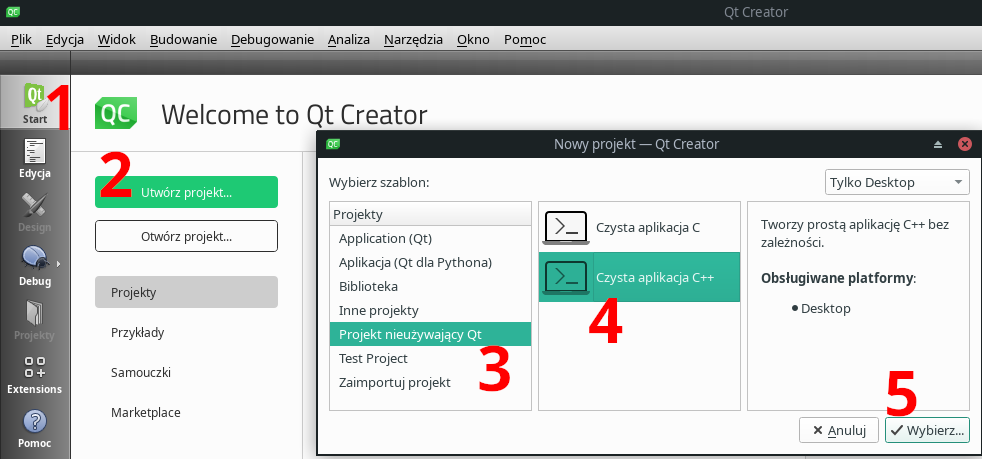
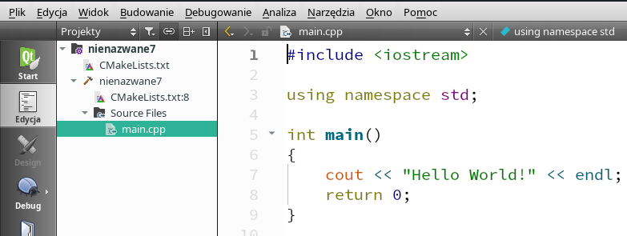
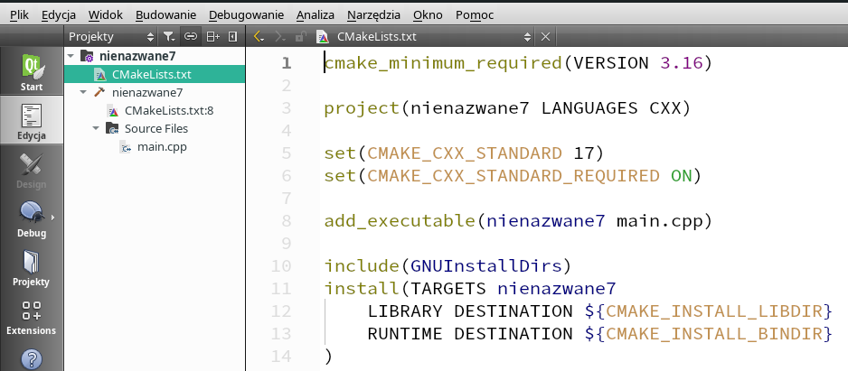

### CMake

#### 1. Projekty

Języka C++ nie stworzono z myślą o niewielkich programach, które zmieszczą się w jednym pliku. Poza programami szkolnymi i studenckimi, programy w C++ z reguły składają się z kilku, kilkunastu, kilkuset, a nawet tysięcy plików źródłowych. Projekty to sposób radzenia sobie z tą złożonością przez programistów i/lub zintegrowane środowiska programistyczne. Projekty zawierają informacje o tym, z jakich plików składa się program lub zestaw programów, z jakich bibliotek korzystają, jak mają być one kompilowane, gdzie i pod jakimi nazwami mają zostać zapisane wyniki kompilacji, gdzie kompilator ma przechowywać pliki pośrednie kompilacji itp. Niestety, nie ma tu żadnych standardów. Microsoft Visual Studio Code ma swój domyślny format projektów, świat Linuksa ma swoje (np. `Makefile`), poszczególne IDE mają swoje (np. `Code::Blocks` czy `CodeLite`), istnieją także rozwiązania uniwersalne. Należy do nich zdobywający bardzo dużą popularność system **CMake**.

Początkujący programiści C++ boją się projektów. To błąd. Jeżeli jakieś zintegrowane środowisko programistyczne potrafi działać nawet bez projektów (podobno Dev-C++ tak potrafi), to z reguły wiąże się to z wyłączeniem większości udogodnień oferowanych przez współczesne IDE, a więc możliwości debugowania kodu czy też korzystania z autouzupełniania czy dynamicznej analizy kodu podczas jego pisania. Bez projektów środowiska programistyczne są w stanie dostrzec co najwyżej jeden plik. Nie tak działa C++.

#### Do czego służy CMake?

Jedną z najbardziej pożądanych cech oprogramowania jest jego [przenośność](https://pl.wikipedia.org/wiki/Przeno%C5%9Bno%C5%9B%C4%87_oprogramowania), czyli możliwość używania tego samego programu na różnych platformach sprzętowych (np. smartfony i komputery klasy PC), w różnych systemach operacyjnych (np. FreeBSD, Linux i Windows) oraz w różnych wersjach tego samego systemu (np. Windows 7 i Windows 11). Jeżeli programy napisane w C++ trzymają się standardu, to są przenośne. Gorzej jest z całym środowiskiem programistycznym, jaki towarzyszy tworzeniu, testowaniu i utrzymaniu kodu - każdy system ma zwykle własne popularne kompilatory, debugery, profilery, generatory dokumentacji i inne oprogramowanie używane przez twórców programów. A nawet jeśli są to te same narzędzia, to przecież niemal na pewno używa ich się nieco inaczej w różnych systemach operacyjnych. Stąd potrzeba uniwersalnego, przenośnego systemu definiowania sposobu kompilacji programów w C++, która stała się szczególnie nagląca wraz z upowszechnieniem się pracy zdalnej, którą często wykonuje się na własnym sprzęcie, na którym zainstalowano swój ulubiony system operacyjny, kompilator, debuger, edytor tekstu i inne narzędzia programistyczne. Jednym z najpopularniejszych takich systemów jest obecnie (rok 2025) system [CMake](https://pl.wikipedia.org/wiki/CMake). System ten, w największym skrócie, zarządza właśnie opisanymi powyżej projektami. Jego największą zaletą jest uniwersalność - te same skrypty wejściowe działaja i robią to samo, choć nie tak samo, w każdym współczesnym systemie operacyjnym i na każdej platformie sprzętowej wspieranej przez CMake.  

#### 3. Najprostszy skrypt programu CMake

Idea CMake jest prosta: programista tworzy skrypt w języku CMake, w którym opisuje, z czego składa się jego projekt  i jak każdy z jego komponentów zależy od innych (np. bibliotek). Najprostszy przykład takiego skryptu wygląda następująco:

 ```cmake
 cmake_minimum_required (VERSION 3.10)
 project(simple)
 add_executable(simple main.cpp)
 ```

W każdym skrypcie CMake potrzebujemy:

- Definicji minimalnej wersji języka CMake, której obsługa jest niezbędna do przetworzenia danego skryptu. Wersja 3.10 jest "bezpieczna" -  wersja `cmake` aktualna w chwili pisania tych słów to 3.31, więc obsługa 3.10 jest powszechna. Mógłbym zamiast `3.10` napisać  powyżej `3.31`, ale co, jeśli ten program chciałbym kiedyś uruchomić w komputerze ze starszą wersją cmake?  
- Nazwy projektu
- Definicji choć jednego celu (ang. *target*) kompilacji. W naszym przypadku celem kompilacji jest wygenerowanie pliku wykonywalnego `simple` na podstawie pliku źródłowego `main.cpp`, a informuje o tym komenda `add_executable`.

Skrypt systemu CMake *zawsze* zapisujemy w pliku o nazwie `CMakeLists.txt`. Następnie używamy go do kompilacji programu. Przyjmijmy, że nasz program w C++ składa się z jednego pliku o nazwie `main.cpp` i że skrypt `CMakeLists.txt` znajduje się w tym samym katalogu co program. Najpierw tworzymy katalog roboczy, w którym CMake wygeneruje pliki, których następnie będzie można użyć do kompilacji programu. Odpowiednia komenda, wydana z katalogu głównego projektu, może wyglądać nastepująco:

 ```bash  
 > cmake -B build .
 ```

W powyższym poleceniu `cmake` to nazwa programu, `-B` to jego opcja opisana w dokumentacji jako "Explicitly specify a build directory", `build` to nazwa katalogu roboczego, a `.` to lokalizacja katalogu z plikiem `CMakeLists.txt`, przy czym pojedyncza kropka jest synonimem katalogu bieżącego. 

Po wykonaniu powyższej komendy `cmake` wyświetli szereg komunikatów, które mogą wyglądać tak:

```txt  
cmake -B build . 
-- The C compiler identification is GNU 14.2.1
-- The CXX compiler identification is GNU 14.2.1
-- Detecting C compiler ABI info
-- Detecting C compiler ABI info - done
-- Check for working C compiler: /usr/bin/cc - skipped
-- Detecting C compile features
-- Detecting C compile features - done
-- Detecting CXX compiler ABI info
-- Detecting CXX compiler ABI info - done
-- Check for working CXX compiler: /usr/bin/c++ - skipped
-- Detecting CXX compile features
-- Detecting CXX compile features - done
-- Configuring done (0.4s)
-- Generating done (0.0s)
-- Build files have been written to: /home/zkoza/Pulpit/Dydaktyka/aaa_pwdp/github/pwdp/cpp/w01/pierwszy_cmake/build
```

Jeżeli wszystko przebiegło prawidłowo, to nie musimy tego czytać. Widzimy, że `cmake` dokonuje analizy naszego systemu (m.in. sprawdza, jaki mamy zainstalowany kompilator), po czym zapisuje jakieś pliki w katalogu wyspecyfikowanym na końcu listy komunikatów. Zauważmy, że nie ma wśród nich pliku wykonywalnego naszego programu, a jedynie pliki (skrypty) umożliwiające kompilację naszego programu na naszym komputerze. Te pliki będą inne w systemie Windows, inne w różnych dystrybucjach Linuksa, jeszcze inne w Mac OS. Aktualną strukturę naszego projektu możemy podejrzeć (Linux) komendą `tree`:

```txt     
> tree -L 2 -F
./
├── build/
│   ├── CMakeCache.txt
│   ├── CMakeFiles/
│   ├── cmake_install.cmake
│   └── Makefile
├── CMakeLists.txt
└── main.cpp
```

Jak widać, `cmake` utworzył, zgodnie z naszym życzeniem, katalog `build` i umieścił w nim kilka plików (np. `Makefile` i `CMakeCache.txt`)  oraz cały katalog ` CMakeFiles`, który będzie jego katalogiem roboczym. 

- Plik `CmakeCache.txt` tworzony jest automatycznie przez cmake przy pierwszej próbie wygenerowania plików służących do kompilacji programu. O ile `CMakeLists.txt` jest wspólny dla wszystkich programistów pracujących w zespole, to wszystko, co znajduje się w katalogu budowania, jest "prywatne". Dotyczy to też pliku `CMakeCache.txt`. Plik ten przechowuje lokalną konfigurację projektu, która może różnić się od konfiguracji współdzielonej przez wszystkich programistów. 
- Plik `Makefile` to skrypt dla programu `make` używanego w systemach typu UNIX do budowania projektów (projekt to jeden lub więcej plików źródłowych, które wymagają kompilacji).
- Plik `cmake_install.cmake` to [skrypt instalacyjny twojego projektu wygenerowany przez cmake](https://stackoverflow.com/questions/25669919/what-is-cmake-install-cmake). Nigdy go nie używałem.  
- Katalog `CMakeFiles` to katalog roboczy programu cmake dla twojego projektu. Nie ma potrzeby tam zaglądać.  

W kolejnym kroku kompilujemy nasz program. Można to zrobić w sposób niezależny od platformy - tak samo w każdej wersji Linuksa, Windows, FreeBSD czy Mac OS. Służy do tego komenda `cmake --build [katalog budowania projektu]`:

```bash 
> cmake --build build
[ 50%] Building CXX object CMakeFiles/simple.dir/main.cpp.o
[100%] Linking CXX executable simple
[100%] Built target simple
```

W powyższym wydruku:

- `cmake` to oczywiście nazwa programu, 
- `--build` to jego opcja, 
- `build` to argument opcji `--build`, czyli nazwa katalogu, w którym ma być budowany projekt i w którym powinien już znajdować się plik `CMakeCache.txt` wygenerowany w poprzednim kroku. 

Pozostałe komunikaty to informacje o postępie kompilacji, szczególnie ważne, gdy kompiluje się ogromne projekty składające się z setek czy nawet tysięcy plików źródłowych. Jak to często bywa, najważniejszy jest ostatni komunikat: `built target simple`, co można przetłumaczyć jako `zbudowano cel simple`. Tutaj `simple` to po prostu nazwa pliku wykonywalnego będącego wynikiem kompilacji naszego programu. Spójrzmy bowiem jeszcze raz na oryginalny skrypt `CMakeLists.txt`:

 ```cmake
cmake_minimum_required(VERSION 3.10)
project(simple)
add_executable(simple main.cpp)
 ```

Nazwa "celu" (ang. *target*) jest tu pierwszym argumentem polecenia `add_executable`. W naszym przypadku jest to `simple`. 

Spójrzmy jeszcze na zawartość naszego katalogu z projektem (bez wgłębiania się głębiej niż na 2 poziomy):

```txt
> tree -L 2 -F
./
├── build/
│   ├── CMakeCache.txt
│   ├── CMakeFiles/
│   ├── cmake_install.cmake
│   ├── Makefile
│   └── simple*
├── CMakeLists.txt
└── main.cpp
```

W katalogu `build` pojawił się nowy plik o nazwie `simple`. Jest to plik wykonywalny (co sygnalizuje gwiazdka po jego nazwie), możemy więc go uruchomić:

```bash
> ./build/simple 
Witaj świecie!
```

I to wszystko! 

---

###### 3.1. Dygresja: make

Powyższy program można także skompilować bezpośrednio ze skryptów wygenerowanych przez`cmake`. W tym celu przechodzimy do katalogu budowania (tu:  `build`) i wydajemy komendę `make`, która skompiluje program w oparciu o instrukcje zawarte w skrypcie `Makefile`:

```txt  
> cd build
> make
[100%] Built target simple
```

Nie jest tu miejsce ni pora na omawianie systemu `make`. W tej chwili wystarczy wiedzieć, że przez dekady był to (i chyba wciąż pozostaje) najpopularniejszy system budowania programów (napisanych w dowolnym języku programowania) pod Linuksem i że jego nauka może trwać miesiące. Na szczęście nie ma takiej potrzeby i tu się tym w ogóle nie będziemy zajmować. Grunt, że wiemy, że `cmake` pracuje w dwóch krokach: najpierw na podstawie uniwersalnego skryptu `CMakeLists.txt` generuje dostosowane do naszego komputera skrypty zawierające konkretny opis kompilacji, potem zaś możemy albo pośrednio za pomocą `cmake`, albo bezpośrednio wykonać proces kompilacji. To, jaką komendą, zależy od systemu. W systemie Linux może to być, jak powyżej, `make`, może też być to jakiś inny system kompilacji, np. `ninja`. Jednym z podstawowych celów stosowania programów typu `make` jest przyspieszenie kompilacji: programy te analizują stan projektu i kompilują tylko te pliki, które tego wymagają.

---

#### 4. Nieco bardziej złożony skrypt programu CMake

Cmake to niezwykle rozbudowany system, który pozwala m.in. w uniwersalny (tj. niezależny od platformy) sposób m.in.:

- Pobierać z internetu lub aktualizować pliki źródłowe bibliotek i/lub programów
- Generować zawartość plików konfiguracyjnych (kody źródłowe) programów w C++ (np. ustalać numer wersji programu czy wartości makr preprocesora)
- Ustalać tryb kompilacji (np. [Debug/Release](Debug/Release), włączanie [sanitizerów kodu](https://en.wikipedia.org/wiki/Code_sanitizer) itp.)
- Kompilować program lub programy, bibliotekę lub biblioteki
- Instalować skompilowane programy i biblioteki
- Generować dokumentację programów bądź bibliotek
- Przeprowadzać testy jednostkowe naszego programu lub biblioteki
- Dokonywać zmian w lokalnym systemie plików (np. generować pliki wejściowe do testów). 

Poza kompilacją programów niczego z powyższego teraz się uczyć nie musisz. CMake, podobnie jak C++, to projekt edukacyjny obliczony na lata. Używaj tylko tego, co rozumiesz i co jest ci w tej konkretnej chwili potrzebne.   

Spróbujmy nieco skomplikować nasz początkowy skrypt `CMakeLists.txt`. Np. możemy zażądać, by kompilator, niezależnie od tego, czy będzie to gcc, clang, icc, aocc czy Visual Studio, pracował w standardzie C++20 (w chwili pisania tych słów domyślnym standardem dla większości kompilatorów jest C++17):

```cmake   
cmake_minimum_required(VERSION 3.10)
project(simple)

set(CMAKE_CXX_STANDARD 20)
set(CMAKE_CXX_STANDARD_REQUIRED ON)

add_executable(simple main.cpp)
```

Powyżej dodałem jeszcze żądanie, że program musi byc kompilowany w standardzie C++20. Jeżeli `cmake` nie znajdzie w naszym systemie kompilatora obsługującego ten standard, to nie wygeneruje plików budowania, a zamiast tego wyświetli komunikat o błędzie.

Dostępne wersje standardu C++ to m.in. `98`, `11`, `17`, `20` i `23`.  Wszystkie wiodące kompilatory w pełni obsługują standard 17 i wcześniejsze, natomiast standardy `20` i późniejsze zwykle obsługiwane są tylko częściowo. Oczywiście za rok czy dwa może się to zmienić.    

Uwaga: mało kto pamięta polecenia CMake albo czy standard języka ustawia się  specjalną komendą języka, czy może poprzez wartość jakiejś zmiennej ustawianej poleceniem `set`. Najczęściej te polecenia kopiuje się ze swojego poprzedniego projektu lub z internetu. 

#### 5. Skrypt dla projektu z kilkoma plikami wykonywalnymi - idealny do list zadań

Skrypt `CMakeLists.txt` w typowym scenariuszu akademickim - lista zadań z trzema zadaniam, z których zadanie 3. rozbite jest na podpunkty a i b, wyglądać może nastepująco: 

```cmake
cmake_minimum_required(VERSION 3.10)
project(lista1)
set(CMAKE_CXX_STANDARD 17)

add_executable(zad1 zad1.cpp)
add_executable(zad2 zad2.cpp)
add_executable(zad3a zad3a.cpp)
add_executable(zad3b zad3b.cpp zad3b.h)
```

Jak widać, `cmake` wygeneruje aż 4 pliki wykonywalne:

- `zad1` na podstawie pliku źródłowego `zad1.cpp`
- `zad2` na podstawie pliku źródłowego `zad2.cpp`
- `zad3a` na podstawie pliku źródłowego `zad3a.cpp`
- `zad3b` na podstawie pliku źródłowego `zad3b.cpp` i pliku nagłówkowego `zad3b.h`.

Warto przy okazji zauważyć, że separatorem kolejnych członów poleceń systemu `cmake` jest nie przecinek, a spacja. 

#### 6. Skrypt dla projektu z kilkoma plikami wykonywalnymi i biblioteką - idealny do późniejszych list zadań

Programy w języku C++ rzadko pisane są wyłącznie w oparciu o standard języka i bibliotekę standardową. Zwykle używamy także zewnętrznych bibliotek. Powiedzmy, że chcemy w naszym programie użyć biblioteki [fmt](https://github.com/fmtlib/fmt). Proszę bardzo:

 ```cmake
 cmake_minimum_required(VERSION 3.10)
 project(lista2)
 set(CMAKE_CXX_STANDARD 17)
 
 add_executable(zad1 zad1.cpp)
 add_executable(zad2 zad2.cpp inne.cpp zad2.h inne.h config.h)
 
 target_link_libraries(zad2 PUBLIC fmt)
 ```

Początek tego skryptu `CmakeLists.txt` wygląda podobnie do poprzedniego. Jak widzimy, tym razem cmake ma utworzyć dwa pliki wykonywalne, `zad1` i `zad2`, przy czym ten drugi zależy od 2 plików źródłowych `zad2.cpp` i `inne.cpp` oraz trzech plików nagłówkowych, `zad2.h`, `inne.h` oraz `confih.h`. Prawdziwą nowością jest ostatnia instrukcja, `target_link_libraries`. Mówi ona, że nasz program `zad2` korzysta z biblioteki `fmt`, dlatego `cmake` musi połączyć (ang. *link*) nasz kod z kodem tej biblioteki. Notabene, plik z biblioteką `fmt` nazywać się będzie `libfmt.a` lub `libfmt.so` w systemie Linux lub `libfmt.dll` w systemie Windows. Każdy z celów (*targets*)  kompilacji może, oczywiście, mieć własne zestawy bibliotek, makr konfiguracyjnych, katalogów roboczych i innych parametrów określających sposób oraz środowisko kompilacji.  

#### 5. Obsługa CMake w zintegrowanych środowiskach programistycznych

Jeżeli zintegrowane środowisko programistyczne nie obsługuje systemu CMake, to czas poświęcony nauce tego IDE to czas stracony. Znam trzy darmowe (dla studentów) zintegrowane środowiska programistyczne obsługujące CMake: QtCreator, CLion i Visual Studio Code. Tego ostatniego nigdy nie używałem, ewentualne pytania proszę kierować do konsultantów firmy Microsoft. Pozostają CLion i QtCreator. 

##### 5.1. CMake w CLion

Sprawa jest prosta: CLion ma doskonałą dokumentację która szczegółowo opisuje sposób posługiwania się systemem CMake w środowisku CLion, https://www.jetbrains.com/help/clion/quick-cmake-tutorial.html. 

##### 5.2. CMake w QtCreator

Po uruchomieniu programu QtCreator pracę nad nowym projektem rozpoczynamy od jego utworzenia. W tym celu w oknie powitalnym (podświetlona ikonka "Start"  w kolumnie po lewej) wybieramy opcję "Utwórz projekt", po czym w oknie dialogowym wybieramy "Projekt nieużywający Qt" oraz "Czysta aplikacja C++":

 

W kolejnych oknach dialogowych wybieramy katalog, w którym zostanie utworzony katalog główny projektu, a także jego nazwę; system budowania (oczywiście wybieramy CMake); zestaw narzędzi (tu wystarczy zaznaczyć tylko "Debug" i "Release"); system kontroli wersji (jeśli nie wiesz, o co chodzi, zostaw tę opcję pustą). To wszystko. Po przyciśnięciu przycisku "zakończ" program wygeneruje standardowy, minimalny plik `CmakeLists.txt` oraz plik `main.cpp` z minimalnym programem w C++:



Standardowy (dla programu QtCtreator) minimalny plik `CMakeLists.txt` sprawia wrażenie dość skomplikowanego:     



W rzeczywistości dwie ostatnie instrukcje (`include` i `install`) można usunąć - i wtedy uzyskamy minimalny plik `CMaleLists.txt` przedstawiony powyżej. 

Przy każdym następnym użyciu klikamy oczywiście przycisk "Otwórz projekt", po czym w oknie dialogowym wybieramy plik `CMakeLists.txt` naszego projektu. 


   
