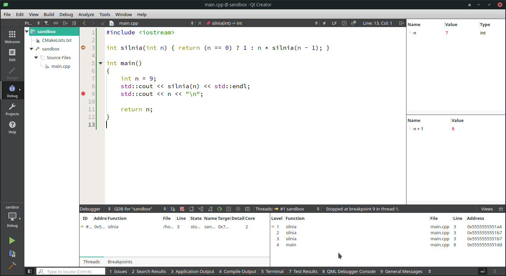
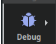
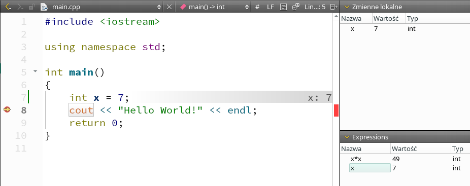
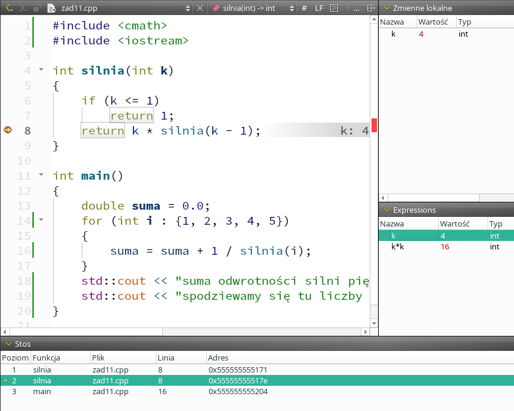

### Debugger

[Debugger](https://en.wikipedia.org/wiki/Debugger) to program wykorzystywany do testowania poprawności i wyszukiwania ewentualnych błędów w innych programach poprzez śledzenie jego stanu podczas jego wykonywania się. Innymi słowy, jest to program, przy pomocy którego możemy przerwać działanie programu (np. napisanego w C++) i dokonać inspekcji jego stanu. W systemie Linux najczęściej wykorzystywany debuger to `gdb`. Jest to potężne narzędzie, umożliwiające użytkownikowi śledzenie przebiegu programu instrukcja po instrukcji, ma jednak pewną wadę - jest to program działający w trybie konsoli (tzw. CLI, *[command line interface](https://en.wikipedia.org/wiki/Command-line_interface)*), co oznacza, że jego użytkownik musi wszystkie jego komendy, w tym nie tylko nazwy, ale i składnię ich użycia, znać na pamięć. Dlatego programu `gdb` rzadko używa się bezpośrednio. Programiści wolą posługiwać się graficznymi nakładkami na debuger, co znacznie zwiększa komfort pracy. Jedna z takich nakładek zintegrowana jest z edytorem QtCreator.  

### Debuger zintegrowany z QtCreator  ###

Przykładowy wygląd programu QtCreator działającego jako nakładka na debuger przedstawia poniższy rysunek:

To, że program pracuje w trybie debugera, sygnalizowane jest podświetleniem symbolu robaczka w pasku narzędzi po lewej stronie okna roboczego programu ().

Podstawowym działaniem podczas pracy z debugerem jest ustalenia w kodzie programu tzw. punktów przerwania (ang. *breakpoints*). Zwykle wystarczy w tym celu kliknąć tuż obok numeru wiersza (po jego lewej stronie), co powinno skutkować wyświetleniem czerwonego kółka:

 

Debuger w programie QtCreator uruchamia się trójkątem z "robaczkiem" symbolizującym błąd w programie, a w CLion - po prostu ikonką "robaczka":

- QTCreator (okolice lewego dolnego rogu okna aplikacji) :  

- CLion (okolice prawego górnego rogu okna aplikacji) : 

Debugerem w zintegrowanych środowiskach programistycznych można sterować za pomocą menu głównego (mało wygodne, ale łatwe do zapamiętania), skrótów klawiaturowych lub przycisków na belce tytułowej okienka interfejsu debugera. Poniżej przykład takiej belki z programu QtCreator:

  

Znaczenie każdego z przycisków można łatwo sprawdzić za pomocą pomocy tooltipów. Najważniejsze, obecne w każdym zintegrowanym debugerze funkcjonalności, to:

-  Uruchom / kontynuuj debugowanie 
-  Zakończ pracę z debugerem (*stop debugger*)
-  Zatrzymaj się za bieżącą instrukcją (*step over*) 
-  Zatrzymaj się za bieżącą instrukcją lub na początku wywołania kolejnej funkcji, o ile bieżąca instrukcja wymaga wywołania jakiejś funkcji (*step into*)
-  Zatrzymaj się tuż po zakończeniu działania bieżącej funkcją (*step out*)

Obok okienka debugera zwykle wyświetla się też okno ze zmiennymi lokalnymi, które może wyglądać tak:

 

Nowoczesne IDE, jak QtCreator czy CLion, wyświetlają też  bieżące wartości zmiennych podczas debugowania jako tzw. "adnotacje" przy kodzie źródłowym kodu źródłowego programu:

Na powyższym zrzucie ekranu wartość zmiennej `x` można odczytać jako adnotację `x: 7` na końcu wiersza z instrukcją `int x = 7;`, można ją też odczytać w okienku `Zmienne lokalne` oraz w konfigurowalnym okienku `Expressions`.  Inna metoda to najechanie kursorem myszy na nazwę interesującej nas zmiennej odczytanie jej stanu z tzw. *tooltipa*, który wyświetli się po kilku sekundach.  

Kolejnym ważnym oknem, z którego korzysta się przy debugowaniu programów, jest tzw. *call stack* (W QtCreatorze znany jako "Stos"):

  

W powyższym przykładzie widzimy, że debuger (w innych oknach) wyświetla informacje o stanie programu zatrzymanego w wierszu 57 pliku `timer.cpp` (żółta strzałeczka na lewym marginesie), że ten wiersz został wywołany z wiersza 26 tego samego pliku, ten z kolei został wywołany w wierszu 22 pliku `my_sparse.cpp`, ten z wiersza 233 pliku `application_runner.cpp`, a ten z wiersza 465 pliku `main.cpp`. W lewej kolumnie widzimy też nazwę każdej z funkcji wywoływanej w danym stanie programu. 

Poniższy rysunek przedstawia przykładowe okno QTCreatora podczas debugowania. 

- Czerwona kropka obok numeru wiersza symbolizuje punkt przerwanai (*breakpoint*).
- Żółta strzałka na lewym marginesie wskazuje kolejną  instrukcję do wykonania.
- W prawej górnej części widzimy okienko "zmienne lokalne" przedstawiające informacje o bieżącym stanie zmiennych lokalnych. Super użyteczne!
- Poniżej, po prawej, znajduje się okno "Expressions", czyli "Wyrażenia". Można tu wpisać dowolne wyrażenie i na bieżąco odczytywać jego wartość.
- Na dole znajduje się okno "Stos", czyli "backtrace", przedstawiające informację o tym, która funkcja na stosie funkcji jest aktualnie analizowana przez debuger.   

Aby debuger mógł powiązać kod wykonywalny programu z odpowiadającym mu kodem źródłowym, kod wykonywalny musi być skompilowany w specjalnym trybie. Tryb ten, w wersji podstawowej, zwyczajowo zwie się `Debug`. W kompilatorach `gcc` i `clang` tryb ten wiąże się z opcją `-g` oraz brakiem jakichkolwiek opcji optymalizacyjnych programu. 