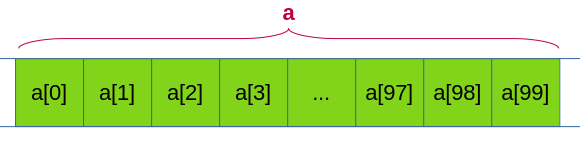
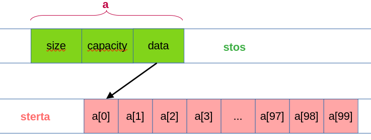

### 3.3 Tablice

Tablica, to w pewnym uproszczeniu, ciągły blok pamięci przydzielony na zmienne tego samego rodzaju. Idea jest prosta. Zamiast deklarować zmienne o nazwach `a0`, `a1`, ..., `a99`, deklarujemy `a` jako tablicę o `100` elementach i każdy z nich identyfikujemy za pomocą specjalnej składni. Np. zamiast `a34` piszemy `a[34]`. Kompilator, zamiast zapamiętywać informację o 100 zmiennych, zapamiętuje tylko adres pierwszej z nich. Do każdej innej uzyskuje dostęp za pomocą argumentu zapisanego w nawiasach kwadratowych. Np. jeżeli `a` jest tablicą `int`-ów i jeżeli typ `int` zajmuje w pamięci 4 bajty, to kompilator element `a[34]` znajdzie, dodając do adresu początku tablicy liczbę `4*34`, czyli 136. Proste! 

A teraz wyobraźmy sobie, że w wielu zagadnieniach inżynierskich, np. obliczeniach prognozy pogody, komputer posługuje się milionami, czasami nawet miliardami liczb! Jak bez tablic można by zapisać programy korzystające z setek milionów zmiennych - nie mam pojęcia. Tym bardziej - jak miałby go skompilować jakikolwiek kompilator. 

Tablice mają też inną, absolutnie fundamentalną cechę: argument operatora `[]` nie musi być tzw. stałą czasu kompilacji (*compile-time constant*), czyli wartością znaną kompilatorowi. Możemy napisać `a[n]`, gdzie `n` jest wyznaczane w trakcie działania programu, jednak nie możemy utworzyć zmiennej `an`, w której `n` byłoby liczbą i jeszcze w dodatku nieznaną kompilatorowi.

Przedstawioną powyżej koncepcję ilustruje poniższy rysunek: 



Należy koniecznie pamiętać, że tablica z definicji zajmuje ciągły obszar pamięci operacyjnej i że cała informacja, jaką potrzebuje kompilator, to adres pierwszego elementu, wartość indeksu i - być może - rozmiar tablicy. 

#### 3.3.1 Tablice "klasyczne" i `std::array` 

Mimo tej prostoty pojęciowej, tablice mają kilka implementacji - i każda z nich ma swoje wady i zalety. Najprostsza implementacja całą pracę nad zarezerwowaniem pamięci dla tablicy przerzuca na kompilator. To oznacza, że rozmiar tablicy musi być znany *przed* uruchomieniem programu. Tablice tego typu definiuje się na dwa sposoby: tradycyjny i nowoczesny.

##### 3.3.1.1 Tablice tradycyjne

Tradycyjna deklaracja tablicy o nazwie `tab` i przechowującej 100 elementów typu `int` wygląda następująco:

```c++
int tab[100];
```

Używamy jej tak, jak to opisałem powyżej, indeksując ją liczbami całkowitymi od `0` do `99`. Przykład:

```c++
tab[0] = 90;
std::cout << tab[0] << "\n";
```

Ogólnie definicja tablicy `nazwa` o `N` elementach typu `T` brzmi:

```c++   
T nazwa[N];
```

W powyższej instrukcji `N` musi być wartością stałą. Tablicę o `N` elementach indeksujemy indeksami z przedziału $0,\ldots,N-1$. Koniecznie trzeba pamiętać, że w C++ indeksem ostatniego elementu tablicy `N`-elementowej jest `N - 1`. Warto też wiedzieć, że [istnieją języki programowania](https://en.wikipedia.org/wiki/Comparison_of_programming_languages_(array)#Array_dimensions), w których tablice indeksowane są liczbami od `1` do `N`. 

Tablica dwuwymiarowa to jednowymiarowa tablica zwykłych tablic. Np. instrukcja

```c++
int tab[4][6];
```

definiuje tablicę 4 na 6 (lub 6 na 4) zmiennych typu `int`. 

W C++ nie sprawdza się poprawności indeksowania tablic. Jeżeli napiszemy więc coś takiego:

```c++  
int tab[100];
tab[100] = 0; // BŁĄD!!!
```

to program się skompiluje (prawdopodobnie z ostrzeżeniem ze strony kompilatora) i wykona, ale standard języka mówi, że nikt nie daje gwarancji, co taki program będzie robić. 

##### 3.3.1.2 Tablice nowoczesne

Tablice nowoczesne zdefiniowano w bibliotece standardowej C++ w pliku nagłówkowym `<array>`. Definiuje się je nieco inaczej niż tablice tradycyjne, ale później używa tak samo. Przykład:

 ```c++
 #include <array>
 int main()
 {
     std::array<int, 100> tab; // tablica stu int-ów
     std::array<std::array<int, 100>, 100>; // tablica 100 na 100 int-ów
 }
 ```

Podejście nowoczesne wymaga od nas nieco więcej pisania, jednak później oferuje pewne udogodnienia, jak np. możliwość odczytania z danej tablicy jej rozmiaru. 

#### 3.3.2 Tablice dynamiczne

Tablice dynamiczne to tablice, które mogą zmieniać swój rozmiar podczas wykonywania się programu. Poniższy rysunek przedstawia schemat ich typowej implementacji.



Tablica dynamiczna składa się z duch części. Pierwsza zarządzana jest prze kompilator, a jej struktura jest niezmienna w czasie; część ta służy do zarządzania danymi i przechowywana jest w segmencie pamięci zwanym stosem, całkowicie zarządzanym przez kompilator. Druga część znajduje się na tzw. stercie, czyli w segmencie pamięci, w którym można rezerwować i zwalniać tę rezerwację swobodnie podczas działania programu. Dzięki temu tablica dynamiczna może mieć zmienną wielkość. 

W C++ tablicę dynamiczną zdefiniowano w pliku nagłówkowym `<vector>` . Używa ich się podobnie do klasycznych tablic o stałej długości.

```c++        
std::vector<int> tab(5);
```

Proszę zwrócić uwagę na to, że tym razem liczbę elementów zapisujemy w nawiasach okrągłych a nie kwadratowych. Wiąże się to z tym, że możemy zamiast liczby znanej kompilatorowi użyć tu zmiennej o nieznanej wartości, a także z tym, że możemy później zmienic rozmiar tak zdefionowanej tablicy dynamicznej. 

```c++
int n; 
std::cin >> n;
std::vector<int> tab(n); // kompilator nie zna wartości n
tab.resize(n * n);       // nowy rozmiar tablicy
```

Jeżeli pominiemy inicjalizator w nawiasach okrągłych, utworzymy tablicę dynamiczną o długości zero:

```   c++
std::vector<int> tab;    // tab jest pusta
```

Oczywiście możemy definiować wektory różnych typów, w tym wektory wielowymiarowe, np.:

```c++
std::vector<double> v (77);       // 77 elementów typu duble
std::vector<std::vector<char>> w; // pusta tablica dynamiczna 2D char-ów  
```

#### 3.3.3 Inicjalizacja tablic

Tablice najlepiej jest od razu inicjalizować, o ile to możliwe. Najczęściej używa się do tego list ujetych w nawiasy klamrowe:

```c++  
int a[3] = {1, 2, 3};
std::array<int, 3> b = {4, 5, 6};
std::vector<int> c = {7, 8, 9};   // kompilator sam się domyśli, że c ma 3 elementy
```

Powyższy zapis można uprościć, choć raczej odradzam korzystanie z tej drogi na skróty osobom uczącym się dopiero programowania w C++:

```c++
int a[] = {1, 2, 3};       // kompilator wydedukuje, że to tablica 3-elementowa
std::array b = {4, 5, 6};  // kompilator wydedukuje, że to tablica 3-elementowa int-ów
std::vector c = {7, 8, 9}; // kompilator wydedukuje, że to wektor 3-elementowy intów
```

W przypadku tablic klasycznych i `std::array` brak inicjalizacji powoduje, że w komórkach pamięci zarezerwowanych na tablicę znajdować się będą tzw. śmieci. W przypadku `std::vector` program wszystkie niezainicjowane elementy wypełni zerami. 