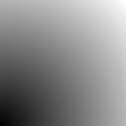

## 4.2 Format PGM

### 4.2.1 Definicja formatu PGM

[PGM](https://netpbm.sourceforge.net/doc/pgm.html) (*Portable Gray Map*) to jeden z najprostszych formatów plików graficznych. Nie jest bardzo popularny, gdyż zapisywane w nim pliki są gigantyczne i nie za bardzo nadają się np. jako grafiki do stron internetowych. Niemniej, ma jedną ogromną zaletę: jest niezwykle prosty i dlatego jest dość popularny wśród osób, które generują obrazy za pomocą programów komputerowych. Uzyskany w ten sposób plik można później łatwo skonwertować do bardziej zwięzłego formatu, jak [PNG](https://pl.wikipedia.org/wiki/Portable_Network_Graphics) czy [JPEG](https://pl.wikipedia.org/wiki/JPEG), za pomocą łatwo dostępnych narzędzi zewnętrznych, np. [GIMP](https://www.gimp.org/).

Plik w formacie PGM może wyglądać tak:

```txt
P2
# feep.pgm
24 7
15
0  0  0  0  0  0  0  0  0  0  0  0  0  0  0  0  0  0  0  0  0  0  0  0
0  3  3  3  3  0  0  7  7  7  7  0  0 11 11 11 11  0  0 15 15 15 15  0
0  3  0  0  0  0  0  7  0  0  0  0  0 11  0  0  0  0  0 15  0  0 15  0
0  3  3  3  0  0  0  7  7  7  0  0  0 11 11 11  0  0  0 15 15 15 15  0
0  3  0  0  0  0  0  7  0  0  0  0  0 11  0  0  0  0  0 15  0  0  0  0
0  3  0  0  0  0  0  7  7  7  7  0  0 11 11 11 11  0  0 15  0  0  0  0
0  0  0  0  0  0  0  0  0  0  0  0  0  0  0  0  0  0  0  0  0  0  0  0
```

W programie [okular](https://pl.wikipedia.org/wiki/Okular_(program_komputerowy)) plik ten [renderowany](https://pl.wikipedia.org/wiki/Renderowanie) jest tak:


Natomiast w programie GIMP, który jest edytorem [rastrowych](https://pl.wikipedia.org/wiki/Grafika_rastrowa) plików graficznych, plik ten renderowany jest następująco:

   

Spójrzmy na nagłówek tego pliku:

```txt
P2
# feep.pgm
24 7
15
```

- Ciąg symboli "[P2](https://en.wikipedia.org/wiki/List_of_file_signatures)" to tzw. "[liczba magiczna](https://en.wikipedia.org/wiki/Magic_number_(programming))" identyfikująca plik jako zawierający obraz w formacie PGM. 
- Dowolny wiersz rozpoczynający się od znaku `#` traktowany jest jako komentarz.
- Kolejne 2 liczby, tu: 24 i 7, identyfikują rozmiar obrazu: ma on 24 kolumny i 7 wierszy
- Kolejna liczba, tu: 15, informuje o maksymalnej wartości nasycenia bieli. Wartość 15 oznacza, że w dalszej części pliku mogą pojawić się wyłącznie liczby z zakresu 0,...,15, przy czym 0 odpowiadać będzie czerni, a 15 - bieli

Po nagłówku następuje seria 24*7 liczb reprezentujących jasność każdego "piksela". Liczby te zapisywane są zwykłym tekstem i oddzielane dowolnym "[białym znakiem](https://en.wikipedia.org/wiki/Whitespace_character)", zwykle spacją lub znakiem przejścia do nowego wiersza, `'\n'`. 

### 4.2.2  Przykład programu

Poniżej przedstawiam prosty program generujący kwadrat z gradientem stopnia szarości biegnącym wzdłuż jednej z jego przekątnych. Obrazek wygląda tak:


Z kolei program wygląda tak ([tutaj do pobrania jest cały projekt)](./cpp/w04/pgm):

```c++
#include <cmath>
#include <fstream>
#include <print>
#include <vector>

int main()
{
    const int length = 250;
    const int height = 250;
    const int max_color = 255;
    const std::string filename = "moj_obrazek_0.pgm";

    std::ofstream out(filename);

    std::vector<std::vector<int>> pixels;
    pixels.resize(height);
    for (int i = 0; i < pixels.size(); i++)
    {
        pixels[i].resize(length);
    }

    for (int y = 0; y < height; y++)
    {
        for (int x = 0; x < length; x++)
        {
            double normalized_value =  std::round(double(x + y) / double(length + height);
            pixels[y][x] = std::round(normalized_value * max_color);
        }
    }

    std::println(out, "P2\n{} {}\n{}", length, height, max_color);
                                                  
    for (int y = 0; y < height; y++)
    {
        for (int x = 0; x < length; x++)
        {
            out << pixels[y][x] << " ";
        }
        out << "\n";
    }
}
```

Przeanalizujmy ten program krok po kroku, fragment po fragmencie.

- Program zaczyna się od włączenia 4 plików nagłówkowych z biblioteki standardowej: 

   ```c++
#include <cmath>    // zaokrąglanie, std::round
#include <fstream>  // obiekty zarządzające plikami, std::ofstream
#include <print>    // łatwy sposób zapisywania danych w plikcach, std::print 
#include <vector>   // tablica dynamiczna, std::vector
   ```

- Funkcja `main` rozpoczyna się od definicji kilku wartości stałych (`const`):

  ```c++
  const int length = 250;                           // długość
  const int height = 250;                           // wysokość
  const int max_color = 255;                        // wartość odpowiadająca bieli 
  const std::string filename = "moj_obrazek_0.pgm"; // nazwa pliku wynikowego
  ```
  
  Użycie modyfikatora `const` nie jest konieczne, ale pomaga zapewnić poprawność programu i ułatwia jego lekturę. 
  
  - Zmienne i obiekty zadeklarowane z modyfikatorem `const` nie mogą być modyfikowane w programie.

- Następnie otwieramy plik do zapisu:

  ```c++ 
  std::ofstream out(filename);
  ```

  Nazwa pliku odczytana zostanie z napisu `filename`.  Następnie dostęp do tego pliku zapewniany będzie przez obiekt `out`. 

- Następnie program tworzy dwuwymiarową tablicę dynamiczną o wartościach typu `int`, po czym nadaje jej odpowiednie rozmiary, najpierw tworząc `height` pustych wierszy, a następnie wydłużając każdy z nich do `length` elementow:

  ```c++ 
  std::vector<std::vector<int>> pixels;   // pusta tablica 2D int-ów
  pixels.resize(height);                  // teraz pixels ma height pustych wierszy
  for (int i = 0; i < pixels.size(); i++) // dla każdego wiersza...
  {
      pixels[i].resize(length);           // zmień jego rozmiar na length
  }
  ```

- Definicje i Inicjalizacje wszystkich obiektów i zmiennych zakończone. Teraz można przystąpić do właściwych działań. W podwójnej pętli (pierwsza po wierszach, druga po kolejnych elementach wiersza) wypełniamy tablicę `pixels`, w której przygotowujemy wartości intensywności bieli, jakie później zapiszemy w pliku.   

  ```c++
  for (int y = 0; y < height; y++)
  {
      for (int x = 0; x < length; x++)
      {
          double normalized_value = double(x + y) / half_perimeter;
          pixels[y][x] = std::round(normalized_value * max_color);
      }
  }
  ```

  W powyższym kodzie `normalized_value` to wartość intensywności bieli znormalizowana do przedziału $[0,1]$. W kolejnej instrukcji mnożymy ją przez `max_color`, by uzyskać wartość z przedziału domkniętego $[0,255]$, przy czym jawnie zaokrąglamy ją do najbliższej liczby całkowitej funkcją `std::round`. Przypominam, że domyślną strategią C++ przy konwersji liczb zmiennopozycyjnych na całkowite jest odrzucanie części ułamkowej. 

- Na koniec nadszedł czas, by zapisać dane do pliku. Najpierw preambuła zawierająca tzw. metadane obrazu: 

  ```c++
  std::println(out, "P2\n{} {}\n{}", length, height, max_color);
  ```

  Instrukcja ta zapisuje w pliku kontrolowanym przez obiekt `out` magiczny identyfikator zawartości pliku  `P2`, trzy liczby całkowite i kilka białych znaków (spacje i znaki przejścia do nowego wiersza). Po jej zakończeniu plik ma 4 wiersze (zauważył(a/e)ś `ln` w nazwie `println`?) i wygląda tak:

  ```txt  
  P2
  250 250
  255
  
  ```

  Oznacza to, że plik 

  - Jest plikiem graficznym w formacie rastrowym PGM zapisanym w trybie tekstowym (`P2`)
  - Ma 250 kolumn 
  - Ma 250 wierszy
  - Pełnej bieli odpowiada wartość 255 

- Następnie zapisujemy wartości stopnia szarości dla każdego piksela:

  ```c++
  for (int y = 0; y < height; y++)
  {
      for (int x = 0; x < length; x++)
      {
          out << pixels[y][x] << " ";
      }
      out << "\n";
  }
  ```

  - Ponieważ dane do pliku PGM zawsze zapisujemy  wierszami, zewnętrzna pętla przebiega po wierszach, a nazwanie zmiennej sterującej znanej z lekcji matematyki literką `y` pomaga zrozumieć logikę programu (intencje programisty). 

  - Tym razem zapis do pliku następuje poprzez operator `<<`  a nie `std::print`. Oba interfejsy mają swoje zalety i wady, oba są używane, nauczyć trzeba się obu. Za pomocą `std::print` instrukcja wewnątrz powyższych pętli wyglądałaby tak:

    ```c++        
    std::print(out, "{} ", pixels[y][x]);
    ```

    a więc wcale nie byłaby krótsza. A tylko taka jest różnica między stosowaniem operatora `<<` i `std::print`. Kod wynikowy jest taki sam.

  - Teoretycznie powyższa pętla jest niezgodna z definicją formatu PGM, który zaleca, by żaden wiersz nie miał więcej niż 70 znaków. Z drugiej jednak strony ten sam standard zaleca, by "Programy odczytujące ten format były tak pobłażliwe, jak to tylko możliwe, akceptując wszystko, co choć trochę przypomina obraz PGM.". Niemniej, wiele programów, w tym np. GIMP, w ogóle nie zapisuje danych w wierszach: każda liczba zapisywana jest w osobnym wierszu.   

- Nasz program nie zapisuje komentarzy.

- W zasadzie to koniec. Program mógłby jeszcze wyświetlać jakiś komunikat powitalny i drugi, na pożegnanie, że pomyślnie utworzył plik.   

#### 4.2.2.1 Dygresja: układ współrzędnych dla zastosowań w grafice komputerowej 

Uważny Czytelnik prawdopodobnie zauważył, że w powyższym programie piksele definiujące obraz zapisywane są w kolejności od wiersza górnego do dolnego i że w związku z tym piksel o współrzędnych $0, 0)$ (wiersz numer 0 i kolumna numer 0) znajduje się w lewym górnym rogu. Wraz ze wzrostem wartości `y` idziemy na ekranie w dół a nie w górę, jak mieliśmy w zwyczaju na lekcjach matematyki. Cechę tę ilustruje poniższy obrazek ([źródło](https://www3.ntu.edu.sg/home/ehchua/programming/opengl/CG_BasicsTheory.html)).  


Domyślne ulokowanie początku układu (punktu o współrzędnych ($0,0$), ang. *origin*) w lewym górnym rogu ekranu lub dowolnego okienka jest konwencją powszechnie przyjętą w chyba wszystkich znanych mi zastosowaniach grafiki komputerowej. W większości systemów graficznych bardzo łatwo można zmienić bieżący układ współrzędnych (punkt zaczepienia, jednostki i zwroty obu osi).  

### 4.2.3 Modyfikacje programu

#### 4.2.3.1 Modyfikacje gradientu

Warto poeksperymentować z naszym programem, modyfikując kilka elementów wpływających na wygląd uzyskiwanego obrazu. Możemy np. zredukować liczbę odcieni szarości do 8 (pamiętając, że czerni zawsze odpowiada wartość 0 a nie 1):

```c++  
const int max_color = 7;
```

Spowoduje to, że zamiast ciągłych przejść nasycenia bieli, zobaczymy kilka pasków o wyraźnie zarysowanych krawędziach. 

Możemy także zmienić sposób przyporządkowywania odwzorowywania współrzędnych piksela na odpowiadający mu stopień szarości:

```c++
for (int y = 0; y < height; y++)
{
    for (int x = 0; x < length; x++)
    {
        double xx = double(x) / length;
        double yy = double(y) / height;
        double q = xx * xx + yy * yy;
        double normalized_value = q / 2.0;
        pixels[length - 1 - y][x] = std::round(normalized_value * max_color);
    }
}
```

W powyższym kodzie:

- `xx` przechowuje wartość współrzędnej `x` piksela znormalizowaną do przedziału $[0,1]$ (konwersja z liczb całkowitych do zmiennopozycyjnych). 

- `yy` przechowuje wartość współrzędnej `y` piksela znormalizowaną do przedziału $[0, 1]$ (konwersja z liczb całkowitych do zmiennopozycyjnych).

- `q` przechowuje wartość sumy kwadratów liczb `xx` i `yy`.

- `normalized_value` to wartość `q` znormalizowana do przedziału $[0,1]$.

- W ostatniej instrukcji nastąpiła zmiana indeksowania tablicy `pixels` z `pixels[y][x]` na

  ```c++  
  pixels[length - 1 - y][x]
  ```

  Odpowiada to przesunięciu środka układu współrzędnych do lewego dolnego rogu obrazka i odwrócenie zwrotu osi 'y' tak, by wskazywała kierunek do góry. Transformacja zawiera wyrażenie `length - 1`, bo `lenrgt - 1` to największa dopuszczalna wartość indeksu `y`. 

- Dodatkowo zmieniłem nazwę pliku wynikowego na `moj_obrazek_pierscienie.pgm`: 

    ```c++
    const std::string filename = "moj_obrazek_pierscienie.pgm";
    ```

Efekt przedstawia poniższy rysunek:


Oczywiście można pójść dalej, Na przykład jeżeli zamiast $x^2 + y^2$ weźmie się $\sqrt{x^2 + y^2})$ i nie zapomni się, że teraz czynnikiem normalizującym jest $\sqrt(2)$, to otrzyma się taki obrazek:


Pierścienie teraz są równe, choć widać też, że wybór `std::round` podczas konwersji do liczb całkowitych nie był chyba najszczęśliwszym rozwiązaniem. 

Jeżeli dodatkowo powiększymy skalę odcieni szarości do 256, to otrzymamy typowy gradient kołowy:



#### 4.2.3.2 Dodawanie warstw

 Dzięki temu, że pracujemy na tablicach i dopiero na sam koniec eksportujemy ich zawartość do plików graficznych, możemy łatwo dodawać "warstwy", czyli łączyć ze sobą kilka niezależnych elementów.  Spójrzmy na poniższy kod. Jego pierwsza część tworzy gradient dokładnie tak, jak w programie z początku tego rozdziału. Druga część dodaje zaś w jego środku czarne kółko (w instrukcji `pixels[y][x] = 0`). 

```c++  
for (int y = 0; y < height; y++)
{
    for (int x = 0; x < length; x++)
    {
        double normalized_value = double(x + y) / half_perimeter;
        pixels[y][x] = std::round(normalized_value * max_color);
    }
}

for (int y = 0; y < height; y++)
{
    for (int x = 0; x < length; x++)
    {
        double dx = x - length / 2.0;
        double dy = y - height / 2.0;
        double r_kwadrat = dx * dx + dy * dy;
        double r = std::sqrt(r_kwadrat);
        if (r > length / 2.0)
            continue;
        pixels[y][x] = 0;
    }
}
```

Efekt:


Projekt z całym programem można pobrać [stąd](./cpp/w04/pgm) (target: `pgm1`).

Jeżeli się dobrze przyjrzeć, to na powyższym obrazku łatwo dostrzeżemy "pikselozę": krawędzie kółka nie są gładkie. Można temu zaradzić, interpolując w okolicach krawędzi kółka kolor między czarnym a kolorem tła. Zastosowanej przez mnie metody nie będę omawiał, zwłaszcza że to rozwiązanie amatorskie. Kod znajduje się w tym samym projekcie jaki target: `pgm2`. Efekt: 


Tu oba kółka w powiększeniu 200% (jak widać, zmniejszyłem też nieco promień kółka, żeby odsunąć je od krawędzi, która nieco przekłamuje perspektywę):


Takie cieniowanie to przykład [antyaliasingu](https://pl.wikipedia.org/wiki/Antyaliasing). 

Antyaliasing nie ma wiele wspólnego z programowaniem jako takim, niemniej, programowanie to nie tylko nauka języka programowania. Antyaliasing jest współcześnie udostępniany przez chyba wszystkie liczące się biblioteki graficzne, proszę nie robić go samodzielnie. Niemniej, znajomość samego zjawiska wydaje się niezbędna dla każdego programisty stosującego grafikę. 

### 4.2.4 Dygresja: porównywanie plików

Powyżej opisałem kilka wersji niemal tego samego programu różniących się od siebie w niewielu miejscach. Pisanie programów to nie tylko programowanie, ale i znajomość różnych aspektów technologii, jak opisany powyżej antyaliasing, oraz narzędzi, jak zintegrowane środowisko programistyczne, `cmake` czy debugger. Jednym z nich jest program `diff`.

Powiedzmy, że chcę sprawdzić, czym plik `pgm0.cpp` różni się od pliku `pgm0a.cpp`. W systemie Linux wydaję polecenie 

```bash
diff --color pgm0.cpp pgm0a.cpp
```

i otrzymuję coś takiego (jest to tzw. patch):

      

Na czerwono wyświetlane są wiersze, które należałoby usunąć z pierwszego pliku, a na zielono - wiersze, które należałoby do niego dodać, by uzyskać z niego plik drugi. Tego typu porównywanie to podstawa systemów kontroli wersji (np. [git](https://pl.wikipedia.org/wiki/Git_(oprogramowanie))), ale tu już odjeżdżam tak bardzo od głównego tematu, że pora kończyć ten wpis.
