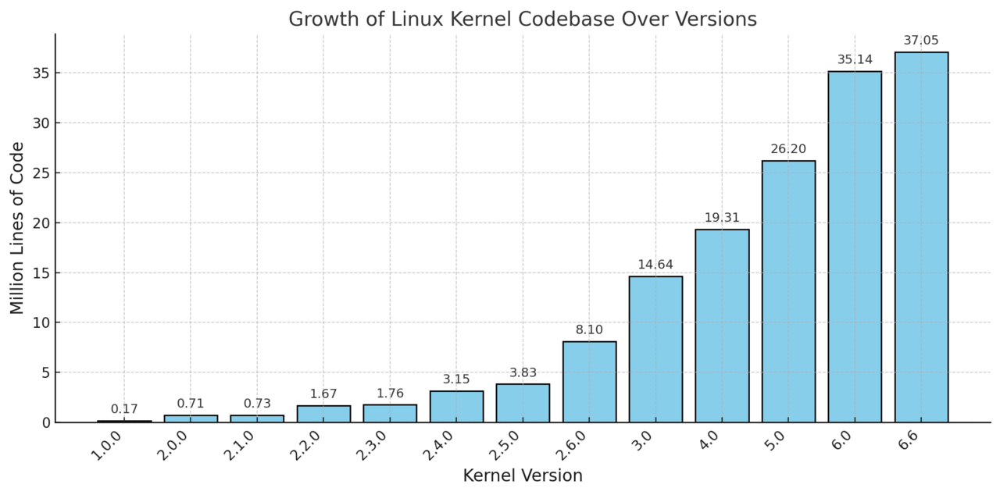

## 5.4  W stronę projektów i bibliotek

Jak już wiemy, praktycznie wszystkie użyteczne programy w C++ składają się z wielu plików. Co więcej, wiele projektów zależy od innych projektów (w tym kontekście zwanych bibliotekami) i nierzadko korzysta bezpośrednio z ich kodów źródłowych, co w sumie może dać miliony wierszy kodu. Dobrym przykładem jest tu jądro systemu operacyjnego Linux: jak podaje [Wikipedia](https://en.wikipedia.org/wiki/Linux_kernel), 

> Version 4.1 of Linux, released in June 2015, contains over 19.5 million lines of code contributed by almost 14,000 programmers.

I dalej

> A total of 1,991 developers, of whom 334 were first-time collaborators,  added more than 553,000 lines of code to version 5.8, breaking the  record previously held by version 4.9.

Skalę problemu obrazuje też wykres zaczerpnięty z tego samego źródła:



Nawet jeśli przyjąć, że typowy plik ma aż 1000 wierszy kodu (jest to bardzo hojne założenie), to najnowsza wersja jądra Linuksa musi mieć co najmniej 37 tysięcy plików źródłowych. Jeżeli kompilacja każdego zajmowałaby tylko 0,1 sekundy, to cała kompilacja trwałaby godzinę. Wyobraźmy sobie pracę w środowisku, w którym sama kompilacja najmniejszej nawet poprawki trwałaby godzinę, a nawet godziny. Co w tym czasie miałby robić programista?

Żeby poradzić sobie z tym problemem, opracowano wiele systemów budowania programów. Większość kompilowanych języków programowania ma własne narzędzia tego typu, nie inaczej jest z C++. Podstawowym celem takiego systemu jest ograniczenie kompilacji do tych operacji, które są faktycznie niezbędne. W szczególności, w pierwszej fazie kompilacji każdy plik źródłowy (`*.cpp`) kompilowany jest niezależnie od reszty plików źródłowych, tak, jakby one w ogóle nie istniały. Kompilator "widzi" tylko ten jeden plik i wszystkie pliki nagłówkowe (`*.h`) i generuje na jego podstawie tzw. plik obiektowy (`*.o` w systemie Linux, `*.obj` w kompilatorach Microsoftu). W drugiej fazie, zwanej konsolidacją lub linkowaniem (ang. *linking*), kompilator łączy pliki obiektowe w plik wykonywalne. To, co istotne, to fakt, że dzięki powyższemu schematowi, poprawki wprowadzone w jednym pliku `cpp` wymagają powtórnej kompilacji tylko tego pliku, potem zaś wystarczy połączyć odpowiadający mu plik obiektowy z resztą przygotowanych wcześniej plików obiektowych, co skraca pełny czas kompilacji o co najmniej rząd wielkości (konsolidacja jest procesem stosunkowo szybkim).

#### 5.3.1. Projekty

W związku z powyższymi uwagami, pojawiał się potrzeba definiowania ***projektów***. Projekt to nic innego jak plik zawierający informację o tym, 

- co jest przedmiotem kompilacji
- jakie zależności występują między plikami projektu 
  - np. informacja, że kompilacja `main.cpp` zależy od treści pliku `pgm.h` 
  - np. informacja, że plik wykonywalny należy połączyć z biblioteką `libpgm.so`
- w jakim trybie chcemy przeprowadzić każdy etap kompilacji
  - np. informacja, że kompilacja jakiegoś modułu ma być przeprowadzona w trybie [Debug](https://ez.analog.com/dsp/software-and-development-tools/cces/w/documents/18461/difference-between-debug-and-release-configurations) sanitizerem [UBSAN](https://clang.llvm.org/docs/UndefinedBehaviorSanitizer.html), a reszty - w trybie Release
  - np. informacja, że kompilacja ma być przeprowadzona konkretnym kompilatorem z konkretną wersją języka i określonym poziomem optymalizacji kodu źródłowego 

Wśród popularnych systemów obsługujących projekty w C++ wymienić warto:

- `make` - do niedawna zdecydowany dominujący system budowania programów w systemie Linux. Cechą charakterystyczną jest plik `Makefile` (definicja projektu zapisana w specjalnym języku skryptowym) i program `make` (Linux) lun `nmake` (MS Windows).
- [projekty code::blocks](https://wiki.codeblocks.org/index.php/Project_file) - to pliki w formacie XML generowane przez popularny program (zintegrowane środowisko programistyczne) code::blocks
- [projekty Visual Studio Code](https://code.visualstudio.com/docs/cpp/config-linux) -  pliki w formacje [JSON](https://pl.wikipedia.org/wiki/JSON) generowane przez Visual Studio Code 
- [ninja](https://ninja-build.org/) - system budowania, mający zastąpić `make`, w którym projekty definiowane są we własnym języku skryptowym

Już na pierwszy rzut oka powyższe rozwiązania mają jedną wadę: są ze sobą niespójne. Dla kogoś, kto pracuje w Visual Studio Code, będzie nie lada wyzwaniem kompilacja programu kogoś, kto pracuje w systemie `make` lub używa code::blocks czy `ninja`. Stąd pojawiła się potrzeba ujednolicenia procesu generowania już nawet nie plików wykonywalnych, a... projektów dostosowanych do danej platformy. W tej chwili najpopularniejszym językiem "metaprojaktowym" jest używany w niniejszym kursie `cmake`.  

- [CMake](https://cmake.org/) - generator projektów. Na podstawie uniwersalnego (wspólnego dla wszystkich systemów operacyjnych, kompilatorów i platform sprzętowych) pliku skryptowego generuje projekt w standardzie `make`, `ninja`, `code::blocks`, `Visual Studio Code` lub kilku innych, zależnie od potrzeb.  
  - CMake, oprócz generatora projektów, zawiera też generator testów, dokumentacji i "paczek" z oprogramowaniem w wersji gotowej do dystrybucji.

Mam nadzieję, że teraz stało się jasne, dlaczego w tym kursie kładę nacisk na `cmake`. Kto zna `cmake`, dogada się obecnie z niemal każdym (profesjonalnym) programistą C++.

##### 5.3.1.1 Przykład

Sprawdźmy, w jaki sposób CMake radzi sobie z projektem [cmake_pierwszy](./cpp/w01/pierwszy_cmake) z wykładu nr 1. Na początku w katalogu projektu mamy dwa pliki, `main.cpp` z kodem źródłowym programu i `CMakeLists.txt` z definicją projektu:

```bash 
> ls -l
razem 8
-rw-r--r-- 1 zkoza zkoza 119 02-23 22:11 CMakeLists.txt
-rw-r--r-- 1 zkoza zkoza  75 02-23 22:16 main.cpp
```

Jeżeli teraz otworzymy w programie QtCreator plik `CmakeLists.txt`, to zostaniemy poproszeni o zgodę na skonfigurowanie projektu. QtCreator uruchomi program `cmake` z dość dużą liczbą opcji:

```txt
[cmake] Uruchamianie /usr/bin/cmake -S /home/zkoza/Pulpit/Dydaktyka/aaa_pwdp/github/pwdp/cpp/w01/pierwszy_cmake -B /home/zkoza/Pulpit/Dydaktyka/aaa_pwdp/github/pwdp/cpp/w01/pierwszy_cmake/build/Desktop-Debug -DCMAKE_C_COMPILER:FILEPATH=/usr/bin/gcc -DCMAKE_CXX_FLAGS_INIT:STRING=-DQT_QML_DEBUG -DQT_QMAKE_EXECUTABLE:FILEPATH=/usr/bin/qmake6 -DCMAKE_PREFIX_PATH:PATH=/usr '-DCMAKE_GENERATOR:STRING=Unix Makefiles' -DCMAKE_CXX_COMPILER:FILEPATH=/usr/bin/g++ -DCMAKE_COLOR_DIAGNOSTICS:BOOL=ON -DCMAKE_BUILD_TYPE:STRING=Debug -DCMAKE_PROJECT_INCLUDE_BEFORE:FILEPATH=/home/zkoza/Pulpit/Dydaktyka/aaa_pwdp/github/pwdp/cpp/w01/pierwszy_cmake/build/Desktop-Debug/.qtc/package-manager/auto-setup.cmake /home/zkoza/Pulpit/Dydaktyka/aaa_pwdp/github/pwdp/cpp/w01/pierwszy_cmake/build/Desktop-Debug.
[cmake] -- The C compiler identification is GNU 14.2.1
[cmake] -- The CXX compiler identification is GNU 14.2.1
[cmake] -- Detecting C compiler ABI info
[cmake] -- Detecting C compiler ABI info - done
[cmake] -- Check for working C compiler: /usr/bin/gcc - skipped
[cmake] -- Detecting C compile features
[cmake] -- Detecting C compile features - done
[cmake] -- Detecting CXX compiler ABI info
[cmake] -- Detecting CXX compiler ABI info - done
[cmake] -- Check for working CXX compiler: /usr/bin/g++ - skipped
[cmake] -- Detecting CXX compile features
[cmake] -- Detecting CXX compile features - done
[cmake] -- Configuring done (0.7s)
[cmake] -- Generating done (0.0s)
[cmake] -- Build files have been written to: /home/zkoza/Pulpit/Dydaktyka/aaa_pwdp/github/pwdp/cpp/w01/pierwszy_cmake/build/Desktop-Debug
[cmake] 
[cmake] Czas trwania: 00:01.
```

Jeżeli nie ma błędów, to nie warto wczytywać się w powyższy komunikat diagnostyczny. To, co jednak w nim widać, to że QTCreator uruchomił program `cmake` z dwiema kluczowymi opcjami, `-S` (lokalizacja pliku `CmakeLists.txt`) oraz `-B` (w którym katalogu `cmake` ma przeprowadzić kompilację). 

Spójrzmy teraz na zawartość katalogu głównego projektu:

```txt
> ls -l
razem 28
drwxr-xr-x 3 zkoza zkoza  4096 03-16 06:26 build/
-rw-r--r-- 1 zkoza zkoza   119 02-23 22:11 CMakeLists.txt
-rw-r--r-- 1 zkoza zkoza 16346 03-16 06:26 CMakeLists.txt.user
-rw-r--r-- 1 zkoza zkoza    75 02-23 22:16 main.cpp
```

Jak widać, pojawił się w nim katalog `build/` - wygenerowany przez `cmake`, oraz plik `CMakeLists.txt.user` wygenerowany przez QtCreator i zawierający konfigurację programu dostosowaną do tego konkretnego projektu. 

Co znajduje się w katalogu `build`? 

```txt 
> ls -lp build/
razem 4
drwxr-xr-x 7 zkoza zkoza 4096 03-16 06:26 Desktop-Debug/
```

Czyli pliki binarne umieszczone będą w katalogu `build/Desktop-Debug`. Taka struktura jest charakterystyczna dla programu QtCreator: jego twórcy zakładają (słusznie!), że zaawansowani użytkownicy będą chcieli móc korzystać z kompilacji w różnych konfiguracjach. Każda będzie umieszczona w osobnym katalogu o nieprzypadkowej nazwie. W `Desktop-Debug` pierwszy człon nawy, `Desktop`, oznacza wybrany zespół narzędzi kompilacji(ang. *kit*), np. nawę kompilatora, jeśli mamy ich kilka, z kolei `Debug` oznacza tryb kompilacji, czyli zestaw flag kompilatora. 

Spójrzmy jeszcze głębiej:

```txt
> ls -lp build/Desktop-Debug/
razem 40
-rw-r--r-- 1 zkoza zkoza 15268 03-16 06:26 CMakeCache.txt
drwxr-xr-x 6 zkoza zkoza  4096 03-16 06:26 CMakeFiles/
-rw-r--r-- 1 zkoza zkoza  2263 03-16 06:26 cmake_install.cmake
-rw-r--r-- 1 zkoza zkoza  5416 03-16 06:26 Makefile
-rw-r--r-- 1 zkoza zkoza   750 03-16 06:26 qtcsettings.cmake
drwxr-xr-x 3 zkoza zkoza  4096 03-16 06:26 Testing/
```

Pojawiło się kilka katalogów i plików. Większość z nich wykorzystywana jest przez `cmake` na własne potrzeby. Są tu jednak dwa pliki szczególnie interesujące:

- `CMakeCache.txt` - to plik konfiguracyjny `cmake`, który możemy edytować, jeżeli wiemy po co i jak. 
- `Makefile` - skrypt programu `make`. 

Program skompilować z poziomu QtCreatora, przyciskając przycisk z młotkiem, jednak widząc plik `Makefile` , możemy tę czynność wykonać ręcznie:

```bash
> cd build/Desktop-Debug/
> make
[ 50%] Building CXX object CMakeFiles/pierwszy.dir/main.cpp.o
[100%] Linking CXX executable pierwszy
[100%] Built target pierwszy
```

Sprawdźmy, jak wygląda teraz katalog budowania projektu:

```txt
> ls -lF
razem 104
-rw-r--r-- 1 zkoza zkoza 15268 03-16 06:26 CMakeCache.txt
drwxr-xr-x 6 zkoza zkoza  4096 03-16 06:50 CMakeFiles/
-rw-r--r-- 1 zkoza zkoza  2263 03-16 06:26 cmake_install.cmake
-rw-r--r-- 1 zkoza zkoza  5416 03-16 06:26 Makefile
-rwxr-xr-x 1 zkoza zkoza 65480 03-16 06:50 pierwszy*
-rw-r--r-- 1 zkoza zkoza   750 03-16 06:26 qtcsettings.cmake
drwxr-xr-x 3 zkoza zkoza  4096 03-16 06:26 Testing/
```

Pojawił się nowy plik o nazwie `pierwszy`. Gwiazdka na powyższej liście oznacza, że jest to plik wykonywalny.

Być może powinienem w tym miejscu omówić plik `Makefile` wygenerowany przez `cmake`, ale nie ma to sensu. Ma on ponad 100 wierszy i w dodatku odwołuje się do kolejnego skryptu systemu `make` o porównywalnej długości. To, co jest dla nas ważne, to informacja, że `Makefile` jest skrojony pod możliwości  i potrzeby mojego systemu. Różni użytkownicy systemu CMake mogą otrzymywać różne pliki konfiguracyjne dla własnego systemu budowania programów, jednak wyjściowy skrypt, `CMakeLists.txt`, jest zawsze taki sam.

#### 5.3.2 Biblioteki

Z biegiem czasu programiści zauważyli, że ten sam kod wykorzystywany jest w wielu niezwiązanych ze sobą kontekstach. Zwykle nie ma większego sensu, by kompilował go użytkownik. Dlatego opracowano sposób, by łączyć pliki obiektowe (= skompilowane pliki źródłowe) w biblioteki. Każda biblioteka dystrybuowana jest w postaci pliku lub plików binarnych z rozszerzeniem `.so` lub `.a` (Linux), lub `.dll` lub `lib` (Windows) oraz zestawu plików nagłówkowych, zwykle z rozszerzeniem `.h` lub `hpp`.

Za przykład nich posłuży biblioteka lz4, opisywana jako "". W mojej dystrybucji dostarczana jest w następującym zestawie:

```txt
/usr/bin/lz4
/usr/bin/lz4c
/usr/bin/lz4cat
/usr/bin/unlz4
/usr/include/lz4.h
/usr/include/lz4frame.h
/usr/include/lz4hc.h
/usr/lib/liblz4.so
/usr/lib/liblz4.so.1
/usr/lib/liblz4.so.1.10.0
/usr/lib/pkgconfig/liblz4.pc
/usr/share/man/man1/lz4.1.gz
/usr/share/man/man1/lz4c.1.gz
/usr/share/man/man1/lz4cat.1.gz
/usr/share/man/man1/unlz4.1.gz
```

Jak widzimy, pakiet `lz4` zawiera kilka plików wykonywalnych w katalogu `/usr/bin`, pliki nagłówkowe w katalogu `/usr/include`, skompilowaną bibliotekę dynamiczną (w wersji `1.10`) w katalogu `/usr/lib` oraz dokumentację w formacie `man` w katalogu `/usr/share/man`. Jeżeli rozpoznaliśmy pliki z rozszerzeniem `.h` i `.so`, to możemy tej biblioteki używać w swoich programach pisanych w C++.

##### 5.3.2.1 Przykład

Oto prosty program wykorzystujący bibliotekę lz4:

```c++
#include <iostream>
#include <lz4.h>

int main()
{
    const int N = 10'000;
    char tekst[] =
        "Szuja - naomamiał, natruł i nabujał\n"
        "Szuja - a wierzyłam przecież mu jak nikt\n"
        "Szuja - dziecku kazał mówić \"proszę wuja\"\n"
        "Alleluja wesołego zrobił mi i znikł\n"
        "Szuja - niewykluta larwa i szczeżuja\n"
        "Szuja - do najtępszych pierwotniaków rym\n"
        "Szuja - bezlitosny kamień i statuja\n"
        "Fałsz i ruja ekskluzywnie powodują nim\n"

        "Gdy życie zdarło z faceta już maskę\n"
        "Gdy mu fasada rozpada się z trzaskiem\n"
        "Gdy zza niej wyjrzy jak dupa z pokrzywy\n"
        "Pysk zły i obrzydliwy i pryśnie cały blef\n"
        "O wtedy chociaż się pragniesz powściągać\n"
        "Nie nasobaczyć i nie naurągać\n"
        "Choć inwektywą żywą nie chcesz chlustać\n"
        "To same usta wykrzykną tobie wbrew:\n"

        "Szuja - pióra by pożyczyć od Anouilh'a (od Anouilh'a)\n"
        "Szuja - by opisać co to jest za typ\n"
        "Szuja - kawał matrymonialnego zbója\n"
        "Z pieszczot dwója, nieudana galareta z ryb\n"
        "Szuja - najpiękniejszy kęs mi życia ujadł\n"
        "Szuja - toczył ze mnie hektolitry łez\n"
        "Szuja - cóż takiego uczyniłam mu ja\n"
        "Żem jak tuja poderżnieta przezeń dzisiaj jest\n"
        "Mówię ci poderżnietą jest\n";

    char bufor[N] = {0};
    auto result = LZ4_compress_default(tekst, bufor, sizeof(tekst) - 1, N);
    std::cout << sizeof(tekst) << " -> " << result << "\n";
}
```

który produkuje następujący wynik:

```txt
1032 -> 891
```

Jego charakterystyczną cechą jest:

- włączenie interfejsu tej biblioteki (`#include <lz4.h>`) 
- użycie co najmniej jednej funkcji z tej biblioteki (tu: `LZ4_compress_default`)
  - definicji tej funkcji nie ma w pliku `lz4.h`. 
  - funkcja `LZ4_compress_default` dołączana jest podczas konsolidacji programu z pliku binarnego  `/usr/lib/liblz4.so`.

Ponieważ korzystamy z biblioteki w postaci binarnej, musimy zmodyfikować sposób kompilacji programu, a najlepiej - stworzyć projekt

-  Kompilacja w linii komend:

  ```txt
  > g++ main.cpp -llz4 
  ```

- Kompilacja poprzez projekt CMake, plik `CMakeFiles.txt`:

  ```cmake
  cmake_minimum_required(VERSION 3.10)
  project(library-project)
  
  set(CMAKE_CXX_STANDARD 17)
  set(CMAKE_CXX_STANDARD_REQUIRED ON)
  
  add_executable(library-project main.cpp)
  target_link_libraries(library-project PUBLIC lz4)
  ```

Warto zwrócić uwagę na to, że o ile plik z biblioteką nazywa się `liblz4` i ma rozszerzenie `so` (lub `a`, `dll` lub `obj`, to w skryptach i argumentach wiersza poleceń pomijamy zarówno rozszerzenie, jak i pierwszą część nazwy, `lib`. 