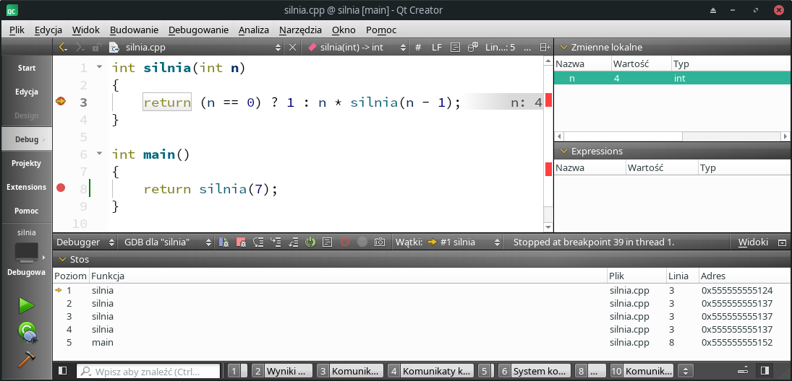

## 7.3 Debugowanie programów z funkcjami rekurencyjnymi

Debugowanie programów z funkcjami rekurencyjnymi niczym nie rożni się od debugowania innych programów, stanowi jednak doskonały pretekst do przedstawienia pewnych technik pracy z debuggerem, które dla programistów C++ są chlebem powszednim, gdyż bardzo ułatwiają poszukiwanie przyczyn błędnego działania programu.

Przyjrzyjmy się [prostemu programowi](./cpp/w07/silnia/) zawierającemu rekurencyjną definicję funkcji silnia:

```c++
int silnia(int n)
{
    return (n == 0) ? 1 : n * silnia(n - 1);
}

int main()
{
    return silnia(7);
}
```

Jeżeli ten program uruchomimy pod kontrolą debugera i wykonamy kilka kroków, to możemy  uzyskać stan jak poniższym obrazku:



Na dole okna programu QtCreator podczas sesji z debuggerem mamy okno zatytułowane "Stos", które wyświetla aktualny stan stosu funkcji programu. Wraz z wykonywaniem kolejnych instrukcji programu pod kontrolą debuggera, stan tego okna ulega zmianie. W chwili uwiecznionej na powyższym zrzucie z ekranu program wywoływał funkcję `silnia` z argumentem `n` równym `4` (por. okienko "Zmienne lokalne" w prawym górnym rogu okna aplikacji), która została wywołana przez funkcję `silnia`, która została wywołana przez funkcję `silnia`, która została wywołana przez funkcję `silnia`, która została wywołana przez funkcje `main`. Żółta strzałka przy nazwie funkcji informuje nas o kontekście, w jakim znajduje się debugger. Innymi słowy, które zmienne uznaje za lokalne w okienku "Zmienne lokalne". Kontekst można zmieniać, klikając dwa razy w nazwę odpowiedniej funkcji w okienku "Stos".     

