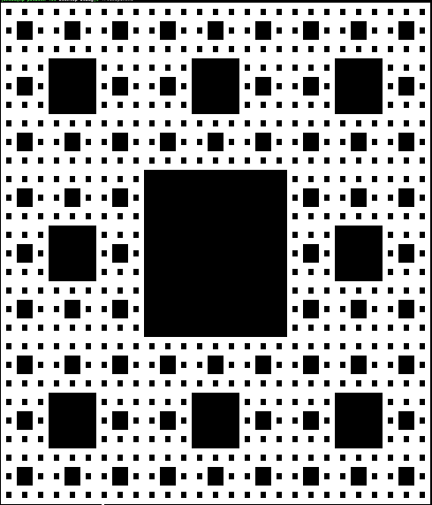

## 7.1 Definicja i przykłady funkcji rekurencyjnych

#### 7.1.1 Definicja

Funkcja rekurencyjna to funkcja, która w określonych sytuacjach wywołuje sama siebie. Tak rozumiana rekurencja może być bezpośrednia, gdy pewna funkcja `f` wywołuje samą siebie, lub pośrednia, gdy np. `f` wywołuje `g`, która z kolei wywołuje `f`.

#### 7.1.2 Przykłady

##### 7.1.2.1 Silnia

Funkcja wyznaczająca wartość silni liczby naturalnej w sposób rekurencyjny to klasyczny przykład funkcji rekurencyjnej:

```c++  
int silnia(int n)
{
    if (n == 0) 
        return 1;
    else
        return n * silnia(n - 1);
}
```

Jak łatwo zauważyć, powyższy kod dokładnie odpowiada matematycznej [definicji funkcji silnia](https://pl.wikipedia.org/wiki/Silnia) w sposób rekurencyjny:
$$
{\displaystyle n!={\begin{cases}1&{\mbox{ dla }}n=0\\[2pt]n\cdot (n-1)!&{\mbox{ dla }}n\geqslant 1\end{cases}}}
$$
Nie jest to przypadek. Funkcje matematyczne zdefiniowane za pomocą rekurencji bardzo łatwo przenosi się do programów komputerowych w językach programowania umożliwiających rekurencyjne wywoływanie funkcji. Takich przykładów poniżej będzie więcej. 

##### 7.1.2.2 Symbol Newtona

Symbol Newtona posiada kilka definicji, w tym rekurencyjną:
$$
 {\displaystyle {n \choose k}={\begin{cases}1&{\mbox{dla }}k=0{\mbox{ lub }}k=n\\{n-1 \choose k-1}+{n-1 \choose k}&{\mbox{dla }}0<k<n\end{cases}}}
$$
Definicję tę łatwo przenosimy do języka C++

```c++   
int newton(int n, int k)
{
    if (k == 0 || k == n)
        return 1;
    return newton(n - 1, k - 1) + newton(n - 1, k);
}
```

##### 7.1.2.3 Dywan Sierpińskiego

Kolejny przykład nie dotyczy funkcji matematycznej. Nasz problem dotyczyć będzie konstrukcji [dywanu Sierpińskiego](https://pl.wikipedia.org/wiki/Dywan_Sierpi%C5%84skiego):


Rozwiązanie rekurencyjne:

```c++
#include <cmath>
#include <iostream>
#include <vector>

using Plansza = std::vector<std::vector<bool>>;

void wytnij(Plansza& plansza, int x0, int y0, int length)
{
    if (length < 3)
        return;
    int smaller = length / 3;
    for (int y = y0 + smaller; y < y0 + 2 * smaller; y++)
    {
        for (int x = x0 + smaller; x < x0 + 2 * smaller; x++)
        {
            plansza[y][x] = true;
        }
    }
    for (int i = 0; i < 3; i++)
    {
        for (int j = 0; j < 3; j++)
        {
            if (i == 1 && j == 1)
                continue;
            wytnij(plansza, x0 + i * smaller, y0 + j * smaller, smaller);
        }
    }
}

void pisz(const Plansza& plansza)
{
    for (const auto& linia : plansza)
    {
        for (auto punkt : linia)
        {
            if (punkt)
                std::cout << "  ";
            else
                std::cout << "██";
        }
        std::cout << "\n";
    }
}

int main()
{
    const int level = 4;
    const int length = std::pow<int>(3, level);
    Plansza plansza(length);
    for (auto& v : plansza)
        v.resize(length);

    wytnij(plansza, 0, 0, length);
    pisz(plansza);
}
```

Idea tego programu jest następująca. Zakładam, że mam kwadratową tablicę zmiennych logicznych (`bool`), a więc o wartościach `false` lub `true` i rozmiarze będącym potęgą trójki, wypełnioną początkowo wartościami `false`. W kolejnych krokach w funkcji `wytnij` dzielę ją na 9 równych kwadratów, po czym kwadrat środkowy "wycinam", nadając wszystkim znajdującym się w nim elementom tablicy wartość `true`. Następnie proces ten wywołuję rekurencyjnie w każdym z pozostałych kwadratów tak długo, aż ich rozmiar będzie mniejszy od 3.

Efekt działania:



Z ciekawostek związanym z C++ w powyższym programie warto zwrócić uwagę na instrukcję

```c++
using Plansza = std::vector<std::vector<bool>>;
```

Wprowadza ona nową nazwę (tu: `Plansza`) istniejącego typu. Pozwala to uprościć zapis kodu odwołującego się do tego typu. 