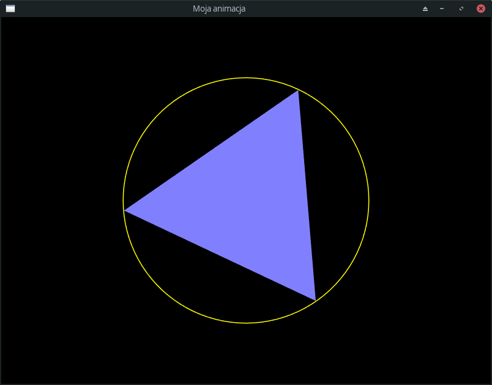

## 13.4.2 Zegar i animacja

Biblioteka SFML bywa używana do tworzenia gier komputerowych, a gry to ruch. Ruch w grafice komputerowej to animacja, czyli statycznych wyświetlanie scen, klatka po klatce, jak w seansie filmowym, z prędkością na tyle dużą, by nasze oczy i mózg dały się oszukać złudzeniu, że mają do czynienia ze zjawiskiem ciągłym, płynnym.

Oto pełny kod programu, wyświetlającego trójkąt równoboczny obracający się wokół swojego środka i umieszczony wewnątrz żółtej obręczy:

```c++    
#include <SFML/Window.hpp>
#include <SFML/Graphics.hpp>

using namespace sf::Literals;

int main()
{
    const int fps = 60;  // frames per second, czyli częstość odświeżania ekranu
    const int window_width = 800;
    const int window_height = 600;
    const auto video_mode = sf::VideoMode(sf::Vector2u(window_width, window_height));

    sf::ContextSettings settings;
    settings.antiAliasingLevel = 8;
    sf::RenderWindow window(video_mode, L"Moja animacja", sf::Style::Default, sf::State::Windowed, settings);

    window.setFramerateLimit(fps);

    sf::CircleShape tri(window_width / 4, 3);
    tri.setFillColor({128, 128, 255});
    tri.setOrigin({window_width / 4.0f, window_width / 4.0f});
    tri.setPosition({window_width / 2.0f, window_height / 2.0f});

    sf::CircleShape circ(window_width / 4, 100);
    circ.setOrigin({window_width / 4.0f, window_width / 4.0f});
    circ.setPosition({window_width / 2.0f, window_height / 2.0f});
    circ.setFillColor(sf::Color::Transparent);
    circ.setOutlineColor(sf::Color::Yellow);
    circ.setOutlineThickness(1.5f);

    while (window.isOpen())
    {
        while (const std::optional event = window.pollEvent())
        {
            if (event->is<sf::Event::Closed>())
                window.close();
        }
        window.clear(sf::Color::Black);
        window.draw(tri);
        window.draw(circ);
        window.display();
        tri.rotate(6_deg / fps);
    }
}

```

Wynik działania tego programu (klatka z płynnej animacji):



#### 13.4.2.1 Wygładzanie krawędzi (antialiasing)

Ten temat zostanie omówiony w [kolejnym rozdziale](./11-SFML-antialiasing.md). Tu wspomnę tylko, że antyaliasing defioniowany jest w powyższym programie instrukcją

```c++
settings.antiAliasingLevel = 8;
```

#### 13.4.2.2 Elementy statyczne. Środek układu współrzędnych lokalnych (*Origin*) 

Program definiuje dwa obiekty wyświetlane na ekranie: trójkąt i obręcz koła. Oba definiowane są w zasadniczo znany już sposób, choć mamy tu pewne nowości. .

- Trójkąt:

  ```c++
  sf::CircleShape tri(window_width / 4.0f, 3);
  tri.setFillColor({128, 128, 255});
  tri.setOrigin({window_width / 4.0f, window_width / 4.0f});
  tri.setPosition({window_width / 2.0f, window_height / 2.0f});
  ```

  Z nowych rzeczy mamy funkcję składową `setOrigin`. Można ją wywołać na dowolnym obiekcie reprezentującym kształt. Ustala ona położenie środka układu współrzędnych używanego podczas transformacji. Jest on wyliczany względem lewego górnego wierzchołka prostokąta, w którym dany kształt jest zdefiniowany. Jeżeli więc chcemy móc obracać trójkąt względem jego środka, to *Origin* umieszczamy w środku koła opisanego na tym trójkącie, czyli w punkcie o współrzędnych $(r, r)$, gdzie $r$ jest promieniem koła równym `window_width / 4`, co wynika ze sposobu konstrukcji obiektu `tri`. Punkt *Origin* jest także celem funkcji składowej `setPosition`: funkcja ta ustala właśnie położenie *Origin*, tyle że we współrzędnych okna. Dlatego środek trójkąta przesuwamy do `{window_width / 2.0f, window_height / 2.0f}`. Jeżeli nie ustawimy własnego położenia *Origin*, SFML zastosuje jego wartość domyślną `{0, 0}`, czyli lewy górny wierzchołek prostokąta opisanego na danym kształcie.   

- Obręcz koła tworzymy następująco:

  ```c++
  sf::CircleShape circ(window_width / 4, 100);
  circ.setOrigin({window_width / 4.0f, window_width / 4.0f});
  circ.setPosition({window_width / 2.0f, window_height / 2.0f});
  circ.setFillColor(sf::Color::Transparent);
  circ.setOutlineColor(sf::Color::Yellow);
  circ.setOutlineThickness(1.5f);
  ```

  Ponieważ obręcz jest duża, więc żeby nie było widać, że konstruowana jest z odcinków, przybliżamy ją za pomocą 100-kąta foremnego (konstruktor obiektu `circ`). Jego środek umieszczamy dokładnie w środku trójkąta. Kolor wypełnienia deklarujemy jako "kolor" przezroczysty, `sf::Color::Transparent`. Na marginesie, "kolor" przezroczysty definiowany jest przez SFML jako obiekt klasy `sf::Color` z wartością kanału alfa równej `0`. Następnie ustalamy kolor i grubość obwódki. 

#### 13.4.2.3 Liczba klatek na sekundę

Liczba klatek na sekundę (klatkaż, ang. *frames per second*, *fps*) to po prostu liczba scen wyświetlanych w ciągu sekundy. W kinach stosuje się *fps* = 24 i nie przeszkadza nam to w uzyskiwaniu wrażenia, że obraz jest płynny. W monitorach kineskopowych nawet przy *fps* = 60 można było zaobserwować migotanie obrazu. W stosowanych obecnie ekranach ciekłokrystalicznych ekran odświeżany jest z częstotliwością od 60 Hz (np. mój laptop) w górę.

Nawet jeżeli możemy wygenerować obraz częściej niż wynoszą fizyczne możliwości ekranu, nie ma to sensu, bo część tej pracy i tak nigdy nie zostanie wyświetlona. Poza tym chcielibyśmy, by nasze animacje zachowywały się podobnie niezależnie od tego, czy uruchamiane są na starym czy też nowym, wydajnym sprzęcie. SFML rozwiązuje oba te problemy jedną funkcją składową. `setFramerateLimit`, której możemy użyć np. tak:           

```c++ 
const int fps = 60; // 60 scen na sekundę
// ...
window.setFramerateLimit(fps);
```

Funkcja ta działa w ten sposób, że za każdym razem, gdy na rzecz okna wywołujemy funkcję `display`, SFML sprawdza, ile czasu opłynęło od wyświetlenia poprzedniej sceny i jeżeli czas ten jest krótszy od `1.0/fps`, to usypia nasz program akurat na taki czas, aby uzyskać docelową prędkość animacji. Bardzo proste i bardzo skuteczne rozwiązanie. 

#### 13.4.2.4  Dostosowanie pętli komunikatów do animacji

Spójrzmy, jak prosto i elegancko można dostosować statyczną pętlę komunikatów do potrzeb animacji: 

```c++
while (window.isOpen())
{
    while (const std::optional event = window.pollEvent())
    {
        if (event->is<sf::Event::Closed>())
            window.close();
    }
    window.clear(sf::Color::Black);
    window.draw(tri);
    window.draw(circ);
    window.display();
    tri.rotate(6_deg / fps);
}
```

Tylko jedna instrukcja odróżnia tę animację od programu wyświetlającego scenę statyczną! Jest to instrukcja 

```c++
tri.rotate(6_deg / fps);
```

Powoduje ona obrócenie trójkąta o kąt `6.0f / fps` stopni. Ponieważ w jednej sekundzie spodziewamy się wyświetlenia `fps` scen, nasz trójkąt będzie się obracał w dobrym przybliżeni z prędkością 6 stopni na sekundę, czyli 360 stopni na minutę, czyli będzie robił jeden pełny obrót na minutę. I to niezależnie od sprzętu, na jakim zostanie uruchomiony!

Jaka jest główna idea powyższego rozwiązania? Otóż po wyświetleniu bieżącej zawartości okna (`window.display()`) po prostu modyfikujemy scenę tak, by odpowiadała kolejnej klatce. W tym celu odpowiednio modyfikujemy składające się na niej obiekty. Modyfikacja ta może dotyczyć położenia, obrotu, skali, koloru wypełnienia lub obramowania itp. Proste! 

Gdyby program był bardziej skomplikowany, przejście do kolejnej klatki wypadałoby oddelegować do osobnej funkcji. Podobnie sprawa ma się z wyświetlaniem sceny.

Kompletny projekt z powyższym programem znajduje się [tutaj](./cpp/w11/sfml-animation).