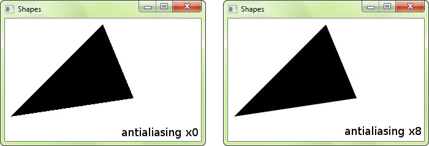

## 13.4.3 Antyaliasing

Antyaliasing to zestaw technik mających na celu redukcję zniekształceń powstających wskutek odwzorowania grafiki o dużej rozdzielczości w urządzeniach o mniejszej rozdzielczości, np. na ekranach monitorów. Chodzi m.in. o to, by linie nachylone pod pewnym kątem do poziomu nie miały widocznych dla ludzkiego oka "schodków" czy "ząbków" i by podobne schodki czy ząbki nie tworzyły się na brzegach kół czy innych krawędzi gładkich.

Oto zaczerpnięty z [podręcznika](https://www.sfml-dev.org/tutorials/3.0/graphics/shape/#custom-shape-types) SFML przykład zniekształceń powstających przy prostym renderowaniu trójkąta (po lewej) oraz efekt korekty wyglądu krawędzi z włączonym antyaliasingiem na poziomie 8:

 

Bardziej szczegółowy opis antyaliasingu można znaleźć m.in. w Wikipedii [polskiej](https://pl.wikipedia.org/wiki/Antyaliasing) i [angielskiej](https://en.wikipedia.org/wiki/Spatial_anti-aliasing).

Jeżeli nie pracujemy na bardzo, bardzo starym sprzęcie i jeżeli nasz program nie jest aż tak zapracowany, by mieć problemy z utrzymaniem odpowiednio dużej częstości odświeżania ekranu, to zapewne chcemy włączyć antyaliasing. W SFML jest to proste. Należy w tym celu odpowiednio ustawić składową `antiAliasingLevel` w obiekcie klasy `sf::ContextSettings` i przekazać go do konstruktora okna jako piąty parametr:

```c++  
sf::ContextSettings settings;
settings.antiAliasingLevel = 8;
sf::RenderWindow window(sf::VideoMode({800, 600}),
                        L"Moje okno",
                        sf::Style::Default,
                        sf::State::Windowed,
                        settings);
```

Zgodnie z opisem, składowa `antialiasingLevel` determinuje liczbę poziomów tzw. [multisample anti-aliasing](https://en.wikipedia.org/wiki/Multisample_anti-aliasing) wykonywanego zwykle sprzętowo na karcie graficznej. Jej typowe wartości to 0, 2, 4 i 8. Im większa wartość, tym z reguły lepszy efekt wizualny, ale i większy koszt obliczeniowy.  

Przykład projektu, w którym zastosowano antyaliasing w SFML, widzieliśmy już  w poprzedniej części tego kursu. Można go pobrać [tutaj](./cpp/w11/sfml-animation/).