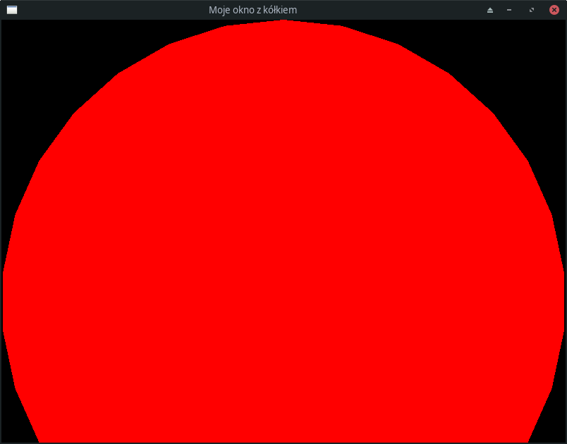

## 11. Przykład programu wykorzystującego bibliotekę SFML

#### 11.1 Program i jego omówienie

Oto pierwszy, dość prosty program w SFML:

```c++
#include <SFML/Window.hpp>
#include <SFML/Graphics.hpp>

int main()
{
    bool visible_shape = true;
    sf::RenderWindow window(sf::VideoMode(sf::Vector2u(800, 600)), L"Moje okno z kółkiem");
    sf::CircleShape shape(400.0f);
    shape.setFillColor(sf::Color::Red);
    while (window.isOpen())
    {
        while (const std::optional event = window.pollEvent())
        {
            if (event->is<sf::Event::Closed>())
                window.close();
            else if (const auto* keyPressed = event->getIf<sf::Event::KeyPressed>())
                visible_shape = !visible_shape;
        }
        window.clear(sf::Color::Black);
        if (visible_shape)
            window.draw(shape);
        window.display();
    }
}
```

Program ten wyświetla okno z nieco za dużym czerwonym koło na czarnym tle, zatytułowane "Moje okno z kółkiem":



Ponadto program odbiera sygnały z klawiatury: wciśnięcie dowolnego klawisza przełącza wyświetlanie kółka  między stanem "widoczny" i "niewidoczny".

Program jest bardzo krótki - funkcja `main` zawiera zaledwie 14 wierszy kodu! Oto przegląd programu, krok po kroku:

- Instrukcje

  ```c++
  #include <SFML/Window.hpp>
  #include <SFML/Graphics.hpp>
  ```

  włączają do programu interfejs dwóch modułów biblioteki SFML: *Window* i *Graphics*.

  - *Window* zawiera klasy i funkcje do obsługi okien oraz różnych urządzeń wejściowych, np. myszy, joysticka, klawiatury itp. 
  - *Graphics* zawiera klasy i funkcje do obsługi operacji graficznych, takich jak definicje kolorów, obsługa czcionek, funkcje do rysowania podstawowych kształtów geometrycznych (tekst, prostokąt, elipsa, obrazki wczytywane z pliku itp.)  

Przechodzimy do funkcji `main`. 

- Instrukcja 

  ```c++
  bool visible_shape = true;
  ```

  definiuje zmienną, która determinuje, czy kółko ma być widoczne, czy niewidoczne.

- Instrukcja

  ```c++
  sf::RenderWindow window(sf::VideoMode(sf::Vector2u(800, 600)), L"Moje okno z kółkiem");
  ```

  tworzy obiekt o nazwie `window` reprezentujący okienko o rozmiarze 800 na 600 pikseli i tytule "Moje okno z kółkiem". Skąd taka a nie inna postać argumentów konstruktora tego obiektu?

  - Dokumentacja klasy `sf::RenderWindow` znajduje się tu: https://www.sfml-dev.org/documentation/3.0.0/classsf_1_1RenderWindow.html 

  - Jeden z konstruktorów posiada następującą deklarację:

    ```c++
    RenderWindow (VideoMode mode, const String &title, std::uint32_t style=Style::Default, State state=State::Windowed, const ContextSettings &settings={})
    ```

    - Pierwszy z nich jest typu `VideoMode`, którego definicję możemy znaleźć pod adresem https://www.sfml-dev.org/documentation/3.0.0/classsf_1_1VideoMode.html. 
    - Drugi argument to napis reprezentujący tytuł tworzonego okna
    - Argumentami kolejnymi się w tej chwili nie przejmujemy, gdyż mają wartości domyślne, które prawdopodobnie mają poprawne (z naszego punktu widzenia) wartości.
    - `VideoMode` określa rozmiar okna oraz głębię kolorów (liczba bitów reprezentujących kolor piksela).
    - Wszystkie klasy i funkcje zdefiniowane w bibliotece SFML umieszczone są w przestrzeni nazw `sf`, stąd wyrażenia `sf::RenderWinow` itp.
    - `sf::Vector2u` to klasa reprezentująca parę liczb (wektor 2D) całkowitych bez znanku (`unsigned`). Stąd w nazwie `2` i `u`.
    - `L"Moje okno z kółkiem"` to napis zapisany w trybie tzw. szerokich znaków. Jest to w SFML konieczne, by móc w nim wyświetlić polskie litery (ogólnie: znaki spoza zestawu ASCII). Szerokie znaki mają to do siebie, że każdy znak przechowywany jest w nich na więcej niż jednym bajcie. Napis zapisany szerokimi znakami rozpoznajemy po literce `L` poprzedzającym tekst w cudzysłowie, np. `L"Ala ma kota"`, `L"Zażółć gęślą jaźń"`.
      - To, czy powinniśmy używać znaków szerokich czy "zwykłych" zależy od biblioteki, której używamy i trybów zapisywania tekstu przez nią obsługiwanych. SFML obecnie nie obsługuje jeszcze standardu UTF-8, ale obsługuje szerokie znaki (oraz ASCII).  

- Instrukcja

  ```c++
  sf::CircleShape shape(400.0f);
  ```

  tworzy obiekt odpowiadający kołu o promieniu 400 pikseli. Opis tej klasy znajdziemy tu: https://www.sfml-dev.org/documentation/3.0.0/classsf_1_1CircleShape.html. Klasa ta ma tylko jeden konstruktor: 

  ```c++
  CircleShape (float radius=0, std::size_t pointCount=30);
  ```

  Klikamy w opis tego konstruktora https://www.sfml-dev.org/documentation/3.0.0/classsf_1_1CircleShape.html#aaebe705e7180cd55588eb19488af3af1 i czytamy, że ma on dwa argumenty:

  - `float radius` - *Radius of the circle*
  - `std::size_t pointCount` - *Number of points composing the circle*

  czyli pierwszy argument oznacza promień okręgu, prawdopodobnie w pikselach, drugi zaś sugeruje, że w SFML okrąg przybliżany jest przez wielokąt foremny z domyślną wartością 30 boków (por.: `pointCount=30`). Warto jeszcze zwrócić na wywołanie konstruktora obiektu w programie

  ```c++
  sf::CircleShape shape(400.0f);
  ```

  Litera `f` tuż za za liczbą (np. `400.0f`) oznacza, że jest to liczba zmiennopozycyjna typu `float`, czyli dokładnie takiego, jakiego wymaga konstruktor. Wywołanie `circle(400)` działałoby równie dobrze, ale byłoby nieco mniej czytelne. W wywołaniu tym nie ma drugiego argumentu, czyli kompilator sam doda drugi argument o wartości domyślnej `30`. 

- Instrukcja 

  ```c++
  shape.setFillColor(sf::Color::Red);
  ```

  ustawia w obiekcie `shape` kolor wypełnienia ("pędzel") na wartość "czerwony". Oznacza to, że koło będzie renderowane w kolorze czerwonym. 

  - W wyrażeniu `sf::Color::Red` wyrażenie `sf` to przestrzeń nazw, `Color` to nazwa klasy (każda klasa definiuje własną przestrzeń nazw), a `Red` to zdefiniowana w tej klasie stała statyczna typu `Color` (`static const Color`).

- Instrukcja 

  ```c++
  while (window.isOpen())
  ```

  tworzy tzw. pętlę komunikatów. Istnienie tej pętli jest charakterystyczną cechą programów sterowanych zdarzeniami. W programach tego rodzaju przepływ programu nie ma formy liniowej, od początku do końca `main`, lecz ma postać w zasadzie nieskończonej pętli, w której program pobiera z otoczenia tzw. komunikaty i je przetwarza. Komunikaty mogą reprezentować takie zdarzenia, jak zmiana rozmiaru okna, ruch myszy, przyciśnięcie klawisza na klawiaturze itp. Pętlę przerywa komunikat, który wprowadza obiekt `window` w stan "*not open*", który może zostać wygenerowany np. przez zamknięcie okna ww standardowy sposób (np. kliknięciem w "krzyżyk" na belce tytułowej okna)

- Instrukcja

  ```c++
  while (const std::optional event = window.pollEvent())
  ```

  tworzy kolejną pętlę, przy okazji tworząc zmienną `event` o zakresie widoczności ograniczonym do tej pętli i zainicjalizowaną wartością zwróconą przez `window.pollEvent()`. W pętli tej z kolejki komunikatów (typu FIFO, *first in, first out*) pobiera się i przetwarza kolejne komunikaty. Funkcja `window.pollEvent()` zwraca kolejny komunikat, jeśli kolejka komunikatów nie jest pusta, lub specjalną wartość `std::nullopt`, jeśli wszystkie komunikaty zostały przetworzone i ich kolejka jest pusta. Dochodzimy do typu wartości zwracanej przez tę funkcję: `std::optional`. Jest to specjalny typ, który może przechowywać zmienną lub obiekt określonego typu lub też jej... nie przechowywać. Coś w rodzaju zmiennej warunkowej - zmienna tego typu może przechowywać wartość określonego typu lub być w stanie "pusty". Dość często używa jej się do zwracania wartości funkcji, które w określonych warunkach mogą nie być w stanie zwrócić pożądanej wartości. W powyższym przypadku idea użycia `std::optional` polega na tym, że jeżeli `event` jest w stanie "pusty", to wiemy, że nie przechowuje żadnego zdarzenia; w przeciwnym wypadku `event` przechowuje zdarzenie, które zapewne trzeba jakoś obsłużyć (lub po prostu pominąć).

  Kiedy powyższa pętla zakończy działanie? Otóż wtedy, kiedy `event` będzie miał wartość konwertowaną na `false`, a skoro jest to obiekt typu `std::optional`, to zdarzy się to dokładnie wtedy, gdy `event` będzie pusty. Czyli pętla skończy się wtedy, gdy skończą zdarzenia do przetworzenia.       

-  Treść wewnętrznej pętli, pobierającej i przetwarzającej komunikaty, wygląda następująco:

  ```c++
  if (event->is<sf::Event::Closed>())
  	window.close();
  else if (const auto* keyPressed = event->getIf<sf::Event::KeyPressed>())
      visible_shape = !visible_shape;
  ```

  Po pierwsze, jak już wiemy, `event` jest obiektem typu `std::optional` który może, ale nie musi przechowywać dane określonego typu. Otóż obsługa obiektów tego rodzaju przypomina obsługę wskaźników: do przechowywanego obiektu uzyskujemy dostęp poprzez `operator->` (dostęp do składowej) lub `operator*` (dostęp do całego obiektu). Czyli `event->is` oznacza, że na `event` uruchamiamy funkcję o nazwie `is<sf::Event::Closed>`, która w dodatku jest wywoływana bez argumentów (`()`). Funkcja ta zwraca `true` wtedy i tylko wtedy, gdy `event` jest typu `sf::Event::Closed`. W tym przypadku zamykamy okno `window`, a wraz z nim całą aplikację instrukcją `window.close();`.

  W przeciwnym wypadku na obiekcie `event` wywołujemy funkcję `getIf` sparametryzowaną typem `sf::Event::KeyPressed`. Funkcja ta zwraca wskaźnik na obiekt, jeżeli `event` jest typu `sf::Event::KeyPressed` lub, w przeciwnym wypadku, `nullptr`. Oznacza to, że instrukcja `visible_shape = !visible_shape;` wywoła się wtedy i tylko wtedy, gdy `event` jest typu  `sf::Event::KeyPressed`. 

- Po zakończeniu wewnętrznej pętli, program wykonuje jeszcze następujące instrukcje:

  ```c++
  window.clear(sf::Color::Black);
  if (visible_shape)
      window.draw(shape);
  window.display();
  ```

  - Pierwsza z nich "czyści" (ang. *clears*) przestrzeń roboczą okna pędzlem czarnym (`sf::color::Black`).
  - Następnie sprawdzamy wartość (naszej) zmiennej logicznej `visible_shape`. Jeśli jest to `true`, to wyświetlamy przygotowany wcześniej kształt (tu: czerwone kółko). 
  - Na koniec musimy wyświetlić przygotowany obraz na ekranie. SFML usiłuje zoptymalizować operacje graficzne. W tym celu operacje w rodzaju `window.draw(shape)` wykonywane są na wewnętrznym buforze pamięci. Instrukcja `window.display()` wysyła zawartość tego bufora do karty graficznej. Wiąże się to z tym, że praktycznie każda operacja na karcie graficznej wiąże się z opóźnieniem rzędu 1 $\mu$s. Jedna operacja to nie problem, ale dziesiątki, setki mogą już powodować odczuwalne opóźnienie w działaniu grafiki. Poza tym chcemy, by grafika, w tym wszelkie animacje, działała płynnie. Nie chcemy widzieć czarnego ekranu na którym po chwili pojawia się czerwone kółko ani innych "migających" fragmentów obrazów, które w ogóle nie powinny być wyświetlane.   

Proszę teraz jeszcze raz przejrzeć cały kod źródłowy - czy wszystko jest już zrozumiałe? 

Projekt zawierający powyższy program można pobrać [tutaj](./cpp/w11/sfml30). Jeżeli używasz wersji SFML wcześniejszej niż 3.0, będziesz musiał(a) przepisać ten kod tak, by dostosować go do używanych tam technik programistycznych i wcześniejszego standardu C++.

#### 11.2 Dodatkowe wyjaśnienia

Sposób, w jaki SFML 3.0 wykorzystuje najnowsze cechy C++ do obsługi zdarzeń nie jest łatwy do wyjaśnienia na obecnym etapie nauki, i chyba nie warto wchodzić w tego rodzaju opisy w sposób szczegółowy. Dla zainteresowanych w dużym skrócie:

- `Event` jest w SFML klasą z wieloma funkcjami składowymi i zaledwie jedną składową zawierającą dane. Jej typem jest `std::variant`, typ generowany z szablonu parametryzowanego innymi typami. Zmienne tego typu przechowują dane dokładnie jednego z tych typów. Istnieje też możliwość odpytania tej zmiennej, jakiego typu dane ona w tej chwili w sobie zawiera. W ten sposób `std::variant` umożliwia pisanie funkcji "wielowartościowych": normalnie w C++ funkcja zawsze zwraca wartość określonego typu, por. `double sin(double)`, która zawsze zwraca `double`. Jeżeli jednak funkcja zwraca `std::variant` lub obiekt zawierający składową `std::variant`, to w ten sposób można "oszukać" system typów C++ i przekazać wartość jednego ze ściśle określonego zbioru typów. W przypadku `Event` te różne typy odpowiadają różnym rodzajom zdarzeń. Dlaczego twórcy SFML wybrali `std::variant` zamiast dziedziczenia i funkcji wirtualnych - nie wiem.

- Do czego służą zdarzenia, czyli obiekty klasy `Event`, pewne wyobrażenie może dać lista ich rodzajów:

  - `Closed`,

  - `Resized`,

  - `FocusLost`,

  - `FocusGained`,

  - `TextEntered`,

  - `KeyPressed`,

  - `KeyReleased`,

  - `MouseWheelScrolled`,

  - `MouseButtonPressed`,

  - `MouseButtonReleased,`

  - `MouseMoved`,

  - `MouseMovedRaw`,

  - `MouseEntered`,

  - `MouseLeft`,

  - `JoystickButtonPressed`,

  - `JoystickButtonReleased`,

  - `JoystickMoved`,

  - `JoystickConnected`,

  - `JoystickDisconnected`,

  - `TouchBegan`,

  - `TouchMoved`,

  - `TouchEnded`,

  - `SensorChanged`

    ​          


