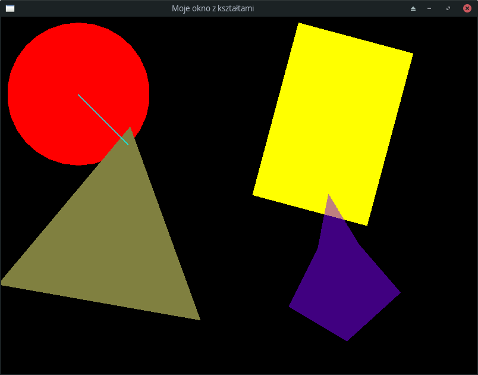

## 11.4.1 Kształty, pozycja, kolor, obrót

Biblioteka SFML zawiera funkcje, dzięki którym w łatwy sposób można narysować na naszym okienku kilka elementarnych kształtów, a także dokonać na nich podstawowych transformacji, jak przesunięcie, przeskalowanie czy obrót, a także nadać im określony kolor. 

Oto prosty przykład ilustrujący te możliwości:

```c++  
#include <SFML/Window.hpp>
#include <SFML/Graphics.hpp>

using namespace sf::Literals;

int main()
{
    const auto video_mode = sf::VideoMode(sf::Vector2u(800, 600));
    sf::RenderWindow window(video_mode, L"Moje okno z kształtami");

    sf::CircleShape circle(120.0f);
    sf::RectangleShape rect(sf::Vector2f{200.0f, 300.0f});
    sf::CircleShape tri(200.0f, 3);
    sf::ConvexShape convex(6);
    sf::RectangleShape line({120, 2});

    circle.setFillColor(sf::Color::Red);
    rect.setFillColor({255, 255, 0});
    tri.setFillColor({128, 128, 64});
    convex.setFillColor({128, 0, 255, 128});
    line.setFillColor({0, 255, 255});

    circle.setPosition({10, 10});
    rect.setPosition({500, 10});
    tri.setPosition({20, 150});
    convex.setPosition({450, 300});
    line.setPosition({130, 130});

    convex.setPoint(0, {100.f, 10.f});
    convex.setPoint(1, {140.f, 100.f});
    convex.setPoint(2, {200.f, 190.f});
    convex.setPoint(3, {100.f, 260.f});
    convex.setPoint(4, {10.f, 190.f});
    convex.setPoint(5, {70.f, 100.f});

    rect.setRotation(sf::degrees(15.0f));
    line.setRotation(sf::radians(0.25 * 3.141592f));
    tri.setRotation(10_deg);
    convex.setRotation(-0.125_rad);

    while (window.isOpen())
    {
        while (const std::optional event = window.pollEvent())
        {
            if (event->is<sf::Event::Closed>())
                window.close();
        }
        window.clear(sf::Color::Black);

        window.draw(circle);
        window.draw(rect);
        window.draw(tri);
        window.draw(convex);
        window.draw(line);

        window.display();
    }
}
```

Program ten wyświetla następujące okienko:



#### 11.4.1.1 Kształty

Istnieją trzy podstawowe kształty, jakie można narysować w SFML: 

- Koło
- Prostokąt
- Wielokąt foremny
- Wielokąt wypukły 

Powyższe nazwy są jednak zwodnicze: SFML wszystkie te kształty, w tym koło, tak naprawdę tworzy z trójkątów, ponadto za pomocą funkcji generującej wielokąty wypukłe można też wyświetlać wielokąty wklęsłe, np. gwiazdy. A poza tym wszystko gra. 

Mamy do dyspozycji trzy obiekty reprezentujące powyższe cztery rodziny kształtów:

- `sf::CircleShape` - koło lub wielokąt foremny

  - koło jest przybliżane 30-kątem foremnym

  - aby narysować wielokąt foremny o innej niż 30 liczbie boków, należy podać go jako drugu argument konstruktora, np.

    ```c++
    sf::CircleShape tri(200.0f, 3); // trójkąt
    ```

- `sf::RectangleShape` - prostokąt

- `sf::ConvexShape` - dowolny wielokąt wypukły, a także niektóre wielokąty wklęsłe

  - SFML rysuje wielokąt wypukły jako sumę wielokątów o wspólnym wierzchołku ulokowanym w środku ciężkości wszystkich wierzchołków.   

Stąd w programie mamy blok instrukcji tworzących obiekty reprezentujące koło, prostokąt, trójkąt równoboczny, wielokąt i linię reprezentowaną przez "cienki prostokąt":

```c++
sf::CircleShape circle(120.0f);
sf::RectangleShape rect(sf::Vector2f{200.0f, 300.0f});
sf::CircleShape tri(200.0f, 3);    // 3 wierzchołki; wpisany w koło o r = 200
sf::ConvexShape convex(6);         // 6 wierzchołków
sf::RectangleShape line({120, 2});
```

Wielokąt wymaga osobnej inicjalizacji, np. tak:

```c++
convex.setPoint(0, {100.f, 10.f});
convex.setPoint(1, {140.f, 100.f});
convex.setPoint(2, {200.f, 190.f});
convex.setPoint(3, {100.f, 260.f});
convex.setPoint(4, {10.f, 190.f});
convex.setPoint(5, {70.f, 100.f});
```

Tutaj dość tajemniczo wyglądają klamry w miejscu drugiego argumentu funkcji `setPoints`. Zgodnie z dokumentacją, typem jej drugiego argumentu jest `sf::Vector2f`, czyli dwuwymiarowy wektor o składowych typu `float`. Najlepszy, choć nieco długi zapis instrukcji `convex.setPoint(0, {100.f, 10.f});` wygląda więc nastepująco:

```c++   
convex.setPoint(0, Vector2f(100.f, 10.f));
```

Idea jest następująca: jeżeli w wyrażeniu `convex.setPoint(5, {70.f, 100.f});` można przed listą ujętą w klamry (czyli przed `{70.f, 100.f}`) wstawić nazwę dokładnie jednego typu użytkownika (np. `Vector2f`) i potraktować  kolejne elementy tej listy jak argumenty konstruktora tej klasy i w wyniku tych operacji uzyska się poprawny kod, to kompilator ma obowiązek wykonać taką transformację. Skraca to kod, choć niekoniecznie czyni go to bardziej czytelnym.

#### 11.4.1.2 Kolory

Każdy kształt posiada "pędzel", którym malowany jest ten kształt, a każdy pędzel ma swój kolor. Za kolory w SFML odpowiada klasa `Color`. Jej konstruktor ma 4 argumenty, którymi są liczby całkowite z przedziału $[0, 255]$, przy czym czwarty argument jest opcjonalny, gdyż posiada wartość domyślną 255. Odpowiadają one nasyceniu składowych RGBA (czerwona, zielona, niebieska, kanał alfa = przezroczystość).     

Przykład:

```c++ 
circle.setFillColor(sf::Color::Red); // predefiniowana stała symboliczna
rect.setFillColor({255, 255, 0});    // czerwony + zielony = żółty
tri.setFillColor({128, 128, 64});    
convex.setFillColor({128, 0, 255, 128}); // alfa = 128, kolor częściowo transparentny
line.setFillColor({0, 255, 255});        
```

#### 11.4.1.3 Pozycja i obrót

Kształty podstawowe umieszczane są wirtualnym (niewidocznym) prostokącie. Współrzędne jego lewego górnego narożnika można ustalić funkcją składową `setPosition`. Podobnie, każdy kształt można obrócić względem tego wierzchołka funkcją `setRotation` (ogólnie: środek obrotu można ustalić funkcją składową `setOrigin`).  

Przykład:

```c++
circle.setPosition({10, 10});
rect.setPosition({500, 10});
tri.setPosition({20, 150});
convex.setPosition({450, 300});
line.setPosition({130, 130});

rect.setRotation(sf::degrees(15.0f));
line.setRotation(sf::radians(0.25 * 3.141592f));
tri.setRotation(10_deg);
convex.setRotation(-0.125_rad);
```

Jak widać, obroty można definiować w stopniach lub radianach. Szczególnie ciekawe są ostatnie dwa z powyższych przykładów. Najnowsze wersje C++ oferują możliwość definiowania przyrostków liczb, np. w wyrażeniu `10_deg` odpowiadającym kątowi 10 stopni lub `-0.125_rad` odpowiadającemu obrotowi o $(1/8 )\pi$ w kierunku przeciwnym do ruchu wskazówek zegara. Aby móc korzystać z tych udogodnień, należy wcześniej w programie wydać polecenie 

```c++   
using namespace sf::Literals;
```

