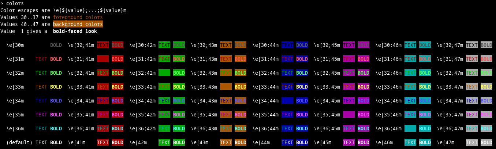

## Lista zadań nr 2

1. (1 pkt.) Napisz program, który:
   - Prosi użytkownika o podanie imienia
   - Wczytuje imię
   - Prosi użytkownika o podanie nazwiska
   - Wczytuje nazwisko
   - Wyświetla imię i nazwisko

2. (1 pkt.) W języku C++ istnieje operator `sizeof`, za pomocą którego możemy sprawdzić, ile miejsca w pamięci operacyjnej (ale tylko tej zarządzanej przez kompilator podczas kompilacji) zajmuje jakaś zmienna, typ lub wyrażenie. Poprawne są wyrażenia `sizeof(int)`, `sizeof(2.345)`,  `sizeof(n)` i `sizeof(n + 1)`, gdzie `n` to np. zmienna typu `int`. 
   - Napisz program, który sprawdzi, jaką wartość zwraca operator `sizeof` dla kilku napisów (tekstów ujętych w cudzysłowy) o różnych długościach, przy czym napisy te mogą zawierać wyłącznie znaki   z zestawu ASCII. Np. `sizeof("Ala")`, `sizeof("123!")` itp. Na tej podstawie wydedukuj zależność ilości pamięci zajmowanej przez taki literał tekstowy od liczby zawartych w nim znaków. 
   - I niech ten program wyświetli także kilka literałów tekstowych zawierających polskie litery (np. ą, ę, ś, ł itd.) wraz z wartością zwracaną przez `sizeof`. Na tej podstawie wydedukuj, ile bajtów zajmują w twoim systemie polskie litery. Uwaga: różne osoby mogą uzyskać różne odpowiedzi.
   - I niech ten program tworzy także kilka obiektów typu `std::string` przechowujących napisy o różnej długości, np. `std::string s1("1")`,  `std::string s2("sześć")` etc. I niech wyświetla wartość zwracaną przez `sizeof` dla każdego z tych obiektów klasy `std::string`. Wydedukuj na podstawie uzyskanego wyniku, czy te napisy przechowywane są w pamięci zarządzanej przez kompilator.

3. (1 pkt.) Pod tym linkiem w serwisie Stack Overflow: https://stackoverflow.com/questions/2616906/how-do-i-output-coloured-text-to-a-linux-terminal znaleźć można odpowiedzi na pytanie, w jaki sposób można wyświetlić na ekranie terminala kolorowy tekst. Używając zawartych tam informacji napisz program, który wypisze twoje imię czcionką zieloną, a nazwisko - czerwoną. Uwaga: różne terminale różnie implementują sposoby zarządzania kolorem w terminalu. Użytkownicy systemu Windows używają go na własne ryzyko. 

   Uwaga: przeczytaj uzupełnienie pod tą listą zadań (dodane po jej napisaniu)! 

4. (praktycznie darmowy 1 pkt.) Napisz program, który wyświetli bezpośrednio jeden po drugim trzy znaki o wartościach szesnastkowych `C4`, `84` i `0a`. Powinieneś ujrzeć literę `Ą`, a kursor powinien przejść do nowego wiersza. Jeśli coś takiego widzisz, to spróbuj domyślić się, jak we współczesnych komputerach kodowane są polskie litery. Pomóc może lektura tej strony Wikipedii: https://pl.wikipedia.org/wiki/Kodowanie_polskich_znak%C3%B3w. Jeżeli używasz Windows, to na własną odpowiedzialność - ja nie mam pojęcia, co Twój program tam wyświetli i jak zinterpretuje znak `0a`.

5. (1pkt.) Użyj `std::format` lub `std::print`, by wyświetlić szesnastkową wartość znaku przejścia do nowej linii: `'\n'`. Jaki jest związek uzyskanej odpowiedzi z treścią poprzedniego zadania? 

6. (1 pkt.) Napisz program, który z konsoli wczyta napis do `std::string` i wyświetli jego postać w kodowaniu [Base16](https://pl.wikipedia.org/wiki/Szesnastkowy_system_liczbowy).  Brzmi strasznie, ale tak naprawdę chodzi o to, by każdy znak wyświetlić w reprezentacji szesnastkowej. 
   Najprostszy sposób przejrzenia zawartości obiektu `napis` typu `std::string` litera po literze:

   ```c++       
   for (auto litera: napis)
   {
       // zrób coś ze zmienną litera
   }
   ```

   Na przykład napis `Brawo!` po zakodowaniu do standardu Base16 przyjmuje postać `427261776F21`. Por. https://simplycalc.com/base16-encode.php.  

#### Uwagi

- Zadanie 3. wprowadza przykład znaku sterującego (czy też sekwencji znaków sterujących). Niektóre urządzenia większość znaków przetwarzają jak litery, natomiast kilka wybranych traktują jak rozkazy. W tym samym strumieniu mamy więc wymieszane dane ("litery") i rozkazy. Innym przykładem znaku specjalnego jest `\` w napisach (np. w napisie `"\"Ala\"\n"` nie ma tak naprawdę żadnego ukośnika). Zadanie 6. pokazuje, jak dowolny ciąg znaków (w tym tych, które można by zinterpretować jako znaki specjalne lub sterujące) zamienić na znaki, które na pewno nie są ani specjalne, ani sterujące, gdyż reprezentowane są przez cyfry i litery. W praktyce (np. przy przesyłaniu załączników w poczcie e-mail) częściej stosuje się nieco bardziej złożone kodowanie [Base64](https://pl.wikipedia.org/wiki/Base64).
- Z kolei zadania 2, 4 i 5 to łagodne wprowadzenie w dziwny świat komputerowej reprezentacji tekstu.  

#### Uzupełnienie

Przypadkiem odkryłem w moim Linuksie komendę `colors`. Oto efekt jej działania:

```bash
> colors
```


